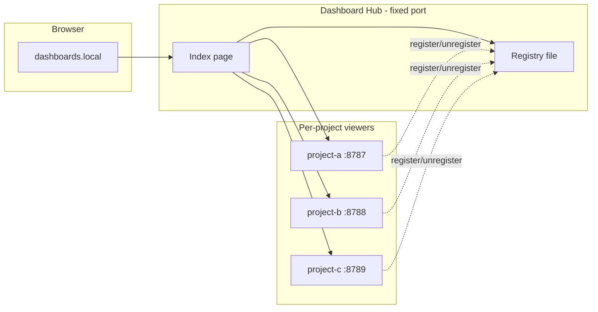

<!-- Generated by SpecStory, Markdown v2.1.0 -->

# 2026-07-23 12:05:46Z

<!-- Cursor CLI Session ade91b44-3b53-4fbd-b1c4-345942027346 (2026-07-23 12:05:46Z) -->

_**User**_

<timestamp>Thursday, Jul 23, 2026, 2:08 PM (UTC+2)</timestamp>
<user_query>
I'm using dashboard.md for multiple projects. Now can I make it that I have some local hosts file (or something like it), where I can open in chrome dashboards/ and it will open a page where I can see all running instances of dashboard + from there open them? What would we need?
</user_query>

---

_**Agent**_

Exploring how `dashboard.md` is set up in this project so we can propose a local launcher page for all running instances.


_**Agent**_

<tool-use data-tool-type="search" data-tool-name="Glob"><details>
<summary>Tool use: **Glob** pattern `**/*`</summary>
Result of search in '/Users/bartb@backbase.com/personal-projects/dashboard': 0 files found
</details></tool-use>

_**Agent**_

<tool-use data-tool-type="search" data-tool-name="Grep"><details>
<summary>Tool use: **Grep** pattern `dashboard` path `/Users/bartb@backbase.com/personal-projects/dashboard`</summary>
No files with matches found
</details></tool-use>

_**Agent**_

<tool-use data-tool-type="search" data-tool-name="Glob"><details>
<summary>Tool use: **Glob** pattern `**/dashboard.md`</summary>
Timed out after 25s
</details></tool-use>

_**Agent**_

<tool-use data-tool-type="search" data-tool-name="Glob"><details>
<summary>Tool use: **Glob** pattern `**/*`</summary>
Timed out after 25s
</details></tool-use>

_**Agent**_

<tool-use data-tool-type="search" data-tool-name="Grep"><details>
<summary>Tool use: **Grep** pattern `dashboard\.md` path `/Users/bartb@backbase.com`</summary>
Error running tool: Timed out after 25s
</details></tool-use>

_**Agent**_

<tool-use data-tool-type="shell" data-tool-name="Shell"><details>
<summary>Tool use: **Shell** `ls -la /Users/bartb@backbase.com/personal-projects/dashboard && find /Users/bartb@backbase.com/personal-projects/dashboard -maxdepth 3 -type f 2>/dev/null | head -50`</summary>
```
Exit code: 0

Command output:

\```
total 0
drwxr-xr-x   2 bartb@backbase.com  staff   64 Jul 23 14:05 .
drwxr-xr-x  25 bartb@backbase.com  staff  800 Jul 23 14:05 ..

\```

Command completed in 570 ms.

Shell state (cwd, env vars) persists for subsequent calls.
```
</details></tool-use>

_**Agent**_

<tool-use data-tool-type="shell" data-tool-name="Shell"><details>
<summary>Tool use: **Shell** `find /Users/bartb@backbase.com/personal-projects -name "dashboard.md" -maxdepth 4 2>/dev/null | head -20`</summary>
```
Exit code: 0

Command output:

\```

\```

Command completed in 561 ms.

Shell state (cwd, env vars) persists for subsequent calls.
```
</details></tool-use>

_**Agent**_

<tool-use data-tool-type="search" data-tool-name="Grep"><details>
<summary>Tool use: **Grep** pattern `dashboard` path `/Users/bartb@backbase.com/.cursor/projects/Users-bartb-backbase-com-personal-projects-dashboard/agent-transcripts`</summary>
../../.cursor/projects/Users-bartb-backbase-com-personal-projects-dashboard/agent-transcripts/ade91b44-3b53-4fbd-b1c4-345942027346/ade91b44-3b53-4fbd-b1c4-345942027346.jsonl
  1:{"role":"user","message":{"content":[{"type":"text","text":"<timestamp>Thursday, Jul 23, 2026, 2:08 PM (UTC+2)</timestamp>\n<user_query>\nI'm using dashboard.md for multiple projects. Now can I make it that I have some local hosts file (or something like it), where I can open in chrome dashboards/ and it will open a page where I can see all running instances of dashboard + from there open them? What would we need?\n</user_query>"}]}}
  2:{"role":"assistant","message":{"content":[{"type":"text","text":"Exploring how `dashboard.md` is set up in this project so we can propose a local launcher page for all running instances.\n\n[REDACTED]"},{"type":"tool_use","name":"Glob","input":{"glob_pattern":"**/*","target_directory":"/Users/bartb@backbase.com/personal-projects/dashboard"}},{"type":"tool_use","name":"Grep","input":{"pattern":"dashboard","path":"/Users/bartb@backbase.com/personal-projects/dashboard","output_mode":"files_with_matches"}}]}}
  3:{"role":"assistant","message":{"content":[{"type":"text","text":"[REDACTED]"},{"type":"tool_use","name":"Glob","input":{"glob_pattern":"**/dashboard.md","target_directory":"/Users/bartb@backbase.com"}},{"type":"tool_use","name":"Glob","input":{"glob_pattern":"**/*","target_directory":"/Users/bartb@backbase.com/personal-projects"}},{"type":"tool_use","name":"Grep","input":{"pattern":"dashboard\\.md","path":"/Users/bartb@backbase.com","head_limit":30}}]}}
  4:{"role":"assistant","message":{"content":[{"type":"text","text":"[REDACTED]"},{"type":"tool_use","name":"Shell","input":{"command":"ls -la /Users/bartb@backbase.com/personal-projects/dashboard && find /Users/bartb@backbase.com/personal-projects/dashboard -maxdepth 3 -type f 2>/dev/null | head -50","description":"List dashboard project files"}},{"type":"tool_use","name":"Shell","input":{"command":"find /Users/bartb@backbase.com/personal-projects -name \"dashboard.md\" -maxdepth 4 2>/dev/null | head -20","description":"Find dashboard.md files in personal-projects"}}]}}
</details></tool-use>

_**Agent**_

<tool-use data-tool-type="shell" data-tool-name="Shell"><details>
<summary>Tool use: **Shell** `find /Users/bartb@backbase.com -name "dashboard.md" -maxdepth 6 2>/dev/null | head -20`</summary>
```
Exit code: 0

Command output:

\```

\```

Command completed in 16704 ms.

Shell state (cwd, env vars) persists for subsequent calls.
```
</details></tool-use>

_**Agent**_

<tool-use data-tool-type="unknown" data-tool-name="WebSearch"><details>
<summary>Tool use: **WebSearch**</summary>
```
Title: Web search results
Content: Links:
1. [](https://specs.md/getting-started/specs-md-dashboard)
2. [](https://specs.md/getting-started/specs-md-dashboard.md)
3. [](https://specs.md/learn/specs-md-dashboard)
4. [fabriqaai/specs.md](https://github.com/fabriqaai/specs.md)
5. [bot-anica/md-viewer-py](https://github.com/bot-anica/md-viewer-py)

Synthesis:
If you are looking to track development progress using a dashboard-style interface for your local Markdown files and AI-driven workflows, you have several options depending on your needs:

For AI-driven workflows specifically using specs.md, you can use the built-in dashboard to monitor progress across FIRE, AI-DLC, or Simple flows [1][2]. It provides a real-time web interface that tracks your local memory-bank, specs, or.specs-fire folders [3][2]. To launch the web dashboard, run npx specsmd@latest dashboard [1][4]; for a terminal-based UI, use npx specsmd@latest dashboard-cli [1][2].

If you need a general-purpose, folder-based Markdown viewer with a dashboard, try md-viewer-py or mdbrowse [5][6]. md-viewer-py is a Python-based, drop-in viewer that offers a grid-style dashboard, live reload, and in-browser editing [5]. Similarly, mdbrowse provides a GitHub-styled browser for the current directory with sidebar navigation and Cmd+K searching [6].

For teams focused on data-driven projects, Evidence is an open-source framework that creates data-centric websites from SQL and Markdown [7]. It allows you to build sophisticated, dashboard-style reports that stay version-controlled as code [7].

Alternatively, Vantage-md offers a polished local viewer with Git awareness, commit history, and diff visualization, which is particularly useful for reviewing LLM-generated Markdown output [8].

Highlights:
<result id="1">
<title></title>
<url>https://specs.md/getting-started/specs-md-dashboard</url>
<content>> Local web and terminal dashboards for tracking development progress across all specsmd flows
...
The default dashboard is a local web app for monitoring your development progress in real time. It reuses the same dashboard UI components as the VS Code extension, runs against the current workspace, and watches for changes as your project state updates.
...
Use `dashboard` for the browser dashboard. Use `dashboard-cli` when you specifically want the interactive terminal UI.
...
The web dashboard starts on `127.0.0.1` by default and opens your browser automatically. When you click a document, story, standard, or artifact, specsmd asks your operating system to open that local file from the current workspace.
...
- See the current AI-DLC bolt/run/spec state while coding in another editor or terminal-native agent
- Review specs, units, stories, standards, and recent completions without running the slower terminal dashboard
- Keep a browser tab open as a live status board while agents update the local `memory-bank`, `.specs-fire`, or `specs` folder
- Click through to local markdown documents and artifacts from the dashboard
...
| Option | Default | Description |
| --- | --- | --- |
| `--flow ` | auto-detect | Flow to inspect: `fire`, `aidlc`, or `simple` |
| `--path ` | current directory | Workspace path to analyze |
| `--host ` | `127.0.0.1` | Host for the local dashboard server |
| `--port ` | random available port | Port for the local dashboard server |
| `--refresh-ms ` | `1000` | Reserved compatibility refresh interval |
| `--no-open` | `false` | Print the URL without opening a browser |
| `--no-watch` | `false` | Disable live file watching
...
auto-detects your flow and starts watching for changes. Press `q` to quit.
...
`--flow ` | auto-detect | Flow to inspect: `fire`,
...
aidlc`, or `simple`
...
| `--path ` | current directory | Workspace path
...
| `--work
...
, or path
...
` | `1000
...
0–5000) |
...
`--no-watch` | `false` | Render once and exit</content>
</result>

<result id="2">
<title></title>
<url>https://specs.md/getting-started/specs-md-dashboard.md</url>
<content>> Local web and terminal dashboards for tracking development progress across all specsmd flows
...
The default dashboard is a local web app for monitoring your development progress in real time. It reuses the same dashboard UI components as the VS Code extension, runs against the current workspace, and watches for changes as your project state updates.

 
 Use `dashboard` for the browser dashboard. Use `dashboard-cli` when you specifically want the interactive terminal UI.
 

## Quick Start
...
The web dashboard starts on `127.0.0.1` by default and opens your browser automatically. When you click a document, story, standard, or artifact, specsmd asks your operating system to open that local file from the current workspace.
...
* See the current AI-DLC bolt/run/spec state while coding in another editor or terminal-native agent
* Review specs, units, stories, standards, and recent completions without running the slower terminal dashboard
* Keep a browser tab open as a live status board while agents update the local `memory-bank`, `.specs-fire`, or `specs` folder
* Click through to local markdown documents and artifacts from the dashboard
...
| Option | Default | Description |
...
| ------------------ | --------------------- | --------------------------------------------- |
...
| `--flow ` | auto-detect | Flow to inspect: `fire`, `aidlc`, or `simple` |
...
| `--path ` | current directory | Workspace path to analyze |
...
| `--host ` | `127.0.0.1` | Host for the local dashboard server |
...
| `--port ` | random available port | Port for the local dashboard server |
...
| `--refresh-ms ` | `1000` | Reserved compatibility refresh interval |
...
| `--no-open` | `false` | Print the URL without opening a browser |
| `--no-watch` | `false` | Disable live file watching
...
auto-detect
...
: `fire`,
...
aidlc`, or `simple`
...
| `--path `
...
current directory | Workspace path
...
-select |
...
worktree (
...
name, id, or path
...
` | `10
...
0–5000) |
...
| `false</content>
</result>

<result id="3">
<title></title>
<url>https://specs.md/learn/specs-md-dashboard</url>
<content>> ## Documentation Index
> Fetch the complete documentation index at: https://specs.md/llms.txt
> Use this file to discover all available pages before exploring further.

# CLI and Web Dashboard Tutorials

> Watch how to use the specs.md terminal dashboard with Codex Desktop App and the web dashboard from Chrome or Fabriqa.AI

## CLI and Web Dashboard Tutorials

Use the specs.md dashboards to monitor your local spec-driven work without living inside VS Code. The terminal dashboard is useful next to Codex Desktop App, while the web dashboard gives you the same visual planning surface from Chrome or a browser opened through Fabriqa.AI.

***

## Web Dashboard from Any Browser

Run the dashboard from your project folder, then open the local URL in Chrome, another browser, or from Fabriqa.AI when you want a browser-based view of the same local specs state.

\```bash theme={null}
npx specsmd@latest dashboard
\```

The web dashboard reads your local `memory-bank`, `.specs-fire`, or `specs` folder, opens on `127.0.0.1`, and updates while agents change the project state.

 

### What You'll See

* Starting the local web dashboard with `npx specsmd@latest dashboard`
* Opening the dashboard from Chrome or another browser
* Using the dashboard from Fabriqa.AI while your specs stay in the local project folder
* Browsing runs, specs, intents, and progress outside VS Code

***

## CLI Dashboard with Codex Desktop App

Use the specs.md terminal dashboard to track progress while building with Codex Desktop App.

 
 This video currently has **no audio** - it's a screen recording walkthrough.
 

 

### What You'll See

* Using the specs.md CLI Dashboard to monitor build progress
* Tracking work items and execution status in real-time
* Building with the Codex Desktop App alongside specs.md

***

## Related Resources

 
 
 Web and terminal dashboard commands, options, and screenshots
 

 
 Learn about FIRE Flow concepts
 

 
 Written getting started guide</content>
</result>

<result id="4">
<title>fabriqaai/specs.md</title>
<url>https://github.com/fabriqaai/specs.md</url>
<content># specs.md
...
**AI-
...
framework with pluggable flows for every use
...
### Dashboard Web
...
Track specsmd flow state from a local browser dashboard:
...
\```bash
npx specsmd@latest dashboard
\```
...
Useful options:
...
\```bash
npx specsmd@latest dashboard --flow fire --path . --no-open
npx specsmd@latest dashboard --host 127.0.0.1 --port 4317
\```
...
Prefer the terminal dashboard?
...
\```bash
npx specsmd@latest dashboard-cli
npx specsmd@latest dashboard-cli --flow fire --path . --refresh-ms 1000
\```
...
## Supported Tools
...
specs.md is **IDE and AI-agnostic**—your specs and agents are portable markdown files that work anywhere.
...
| Tool | Integration |
| --- | --- |
| **Claude Code** | Slash commands in `.claude/commands/` |
| **Cursor** | Rules in `.cursor/rules/` (`.mdc` format) |
| **GitHub Copilot** | Agents in `.github/agents/` (`.agent.md` format) |
| **Google Antigravity** | Agents in `.agent/agents/` |
| **Windsurf** | Rules in `.windsurf/rules/` |
| **Amazon Kiro** | Steering in `.kiro/steering/` |
| **Gemini CLI** | Commands in `.gemini/commands/` (`.toml` format) |
| **Cline** | Rules in `.clinerules/` |
| **Roo Code** | Commands in `.roo/commands/` |
| **OpenAI Codex** | Config in `.codex/` |
| **OpenCode** | Agents in `.opencode/agent/` |</content>
</result>

<result id="5">
<title>bot-anica/md-viewer-py</title>
<url>https://github.com/bot-anica/md-viewer-py</url>
<content>Drop-in Markdown viewer for any folder. Dashboard, live reload, dark/light themes, in-browser editing - just pip install md-viewer-py and run mdview.
...
---

 
 
 

 md-viewer-py 

 
 
 
 
 

 Drop-in Markdown viewer for any folder 

A local HTTP server that renders Markdown files in the browser with navigation, search, and editing. Install and run:
...
Point it at any folder and instantly browse your docs - no config files, no build step, no Node.js. It comes with sidebar navigation, global search, table of contents, dark mode, Mermaid diagrams, syntax highlighting, and an in-browser editor with live preview, all powered by Python's stdlib HTTP server and a single dependency (`watchdog`).
...
\```bash
mdview
...
# serve current directory on port
...
8080
...
mdview --port
...
mdview /path
...
to/docs
...
mdview /path/to/docs --readonly
...
public hosting)
...
help                 # show all options
...
- **Dashboard**: grid view of folders and files, macOS Finder-style
- **Dark & light themes**: auto-detects OS preference, manual toggle
- **File tree sidebar**: collapsible directories with file name filter
- **Global search**: search across all files from header with dropdown results
- **In-file search**: Cmd/Ctrl+F to find and highlight matches
- **Table of contents**: right panel with scroll spy and collapsible groups
...
- **In-browser editing**: edit mode with live preview, save to disk
- **Live reload**: instant updates when files change on disk
...
- **Syntax highlighting**: for code blocks in all major languages
...
- **Mermaid diagrams**: rendered
...
with error feedback
...
- **LaTeX
...
$$` rendered with KaTeX
...
`md-viewer-py` is a pip-installable HTTP server built on Python's `http.server`. It scans the directory for `.md` files, serves a single-page UI with dark and light themes, and renders Markdown client-side using [marked.js](https://github.com/markedjs/marked) from a CDN. No build step, no config files. Just install and run.</content>
</result>
---

```
</details></tool-use>

_**Agent**_

<tool-use data-tool-type="shell" data-tool-name="Shell"><details>
<summary>Tool use: **Shell** `which dashboard 2>/dev/null; npm list -g 2>/dev/null | rg -i dashboard; brew list 2>/dev/null | rg -i dashboard; ls ~/cli-tools 2>/dev/null | rg -i dash`</summary>
```
Exit code: 1

Command output:

\```
dashboard not found

\```

Command completed in 866 ms.

Shell state (cwd, env vars) persists for subsequent calls.
```
</details></tool-use>

_**Agent**_

<tool-use data-tool-type="unknown" data-tool-name="WebSearch"><details>
<summary>Tool use: **WebSearch**</summary>
```
Title: Web search results
Content: Links:
1. [feat: add dashboard-viewer — live Markdown viewer for dashboard.md](https://github.com/yohey-w/multi-agent-shogun/pull/122)
2. [commenthol/md-fileserver](https://github.com/commenthol/md-fileserver)
3. [](https://specs.md/getting-started/specs-md-dashboard.md)
4. [](https://specs.md/learn/specs-md-dashboard.md)
5. [docs/guides/dashboard.md](https://github.com/veerps57/memento/blob/main/docs/guides/dashboard.md)

Synthesis:
To serve a local markdown file or directory as a web dashboard, you can use several tools depending on your needs.

For a zero-dependency Python-based viewer that auto-refreshes `dashboard.md`, use the `dashboard-viewer.py` script [1]:
python3 scripts/dashboard-viewer.py

For a general-purpose local markdown server, `md-fileserver` is a common npm tool [2]:
npm install -g md-fileserver
mdstart [file.md]

If you are using specific development frameworks, use their built-in dashboard commands:
Specs.md: npx specsmd@latest dashboard [3][4]
Memento: npx @psraghuveer/memento dashboard [5]
Claude Code: npx @viren/claude-code-dashboard --open [6]

Highlights:
<result id="1">
<title>feat: add dashboard-viewer — live Markdown viewer for dashboard.md</title>
<url>https://github.com/yohey-w/multi-agent-shogun/pull/122</url>
<content># feat: add dashboard-viewer — live Markdown viewer for dashboard.md
...
- Adds `scripts/dashboard-viewer.py`: a zero-dependency Python 3 HTTP server that serves `dashboard.md` as a live browser page with ~1.5s auto-refresh
- Updates `first_setup.sh` to install a `dash()` shell function into `~/.bashrc`, so running `dash` from any directory launches the viewer and opens a browser tab
- Updates `.gitignore` to allowlist `scripts/dashboard-viewer.py`
...
\```bash
# After running first_setup.sh and sourcing ~/.bashrc:
dash

# Or directly:
python3 scripts/dashboard-viewer.py
\```
...
Opens `http://127.0.0.1:8787` — GitHub-style dark theme, auto-refreshes when `dashboard.md` changes.
...
- **Zero dependencies** — uses only Python 3 standard library (no pip install)
- **Auto-refresh** — polls for file changes every 1.5s; status bar shows Live/stale
- **Markdown rendering** — via marked.js (CDN)
- **Port conflict detection** — clear error if port 8787 is already in use
...
- [ ] Run `python3 scripts/dashboard-viewer.py` in a repo with `dashboard.md` → browser opens at `http://127.0.0.1:8787`
- [ ] Edit `dashboard.md` → browser auto-refreshes within ~2s
- [ ] Run `first_setup.sh` → `dash()` function added to `~/.bashrc`
- [ ] Run `dash` → same behaviour as direct invocation</content>
</result>

<result id="2">
<title>commenthol/md-fileserver</title>
<url>https://github.com/commenthol/md-fileserver</url>
<content>Locally view markdown files in a browser.
...
# md-fileserver
...
> Locally view markdown files in a browser.
...
[](https://www.npmjs.com/package/md-fileserver/)
...
Build Status](https://github.com/
...
/md-fileserver
...
hol/md
...
%3Amaster)
...
Starts a local server to render "markdown" files within your browser:
...
- Runs on `localhost:4000`
- Supports [Markdown Syntax][] with [GFM][].
- Markdown rendering based on [markdown-it][].
...
- Includes [markedpp][] as preprocessor.
- Supports syntax highlighting using [highlight.js][]
- For supported markdown syntax see [Cheatsheet][].
- Automatic update in browser after saving edited file. (Tested on Linux, MacOS, Windows)
- Support for [confluencer][]. Needs to be enabled in `/config`.
...
\```bash
npm install -g md-fileserver
\```
...
### Start the Local Server
...
In your terminal type:
...
\```
mdstart
\```

Open the given link in your browser and
navigate to the markdown file.

**Note**: The local server can only be reached from your local computer on port 4000.
Any remote access from other computers to your files is denied.
An internal session is used, so you'll need to either start with a file or use the provided
link with the session parameter.
...
### Open a markdown file
...
Type in your terminal:
...
\```
mdstart <file.md>
\```
...
This will open the default browser with the processed markdown file.
...
\```
mdstart /config
\```


...
In `config.js` you can change several settings to fit your needs. These include:
...
- **Browser**: Default browser of MacOS, Linux or Windows is used.
- **Markdown** options: Change the options how [markdown-it][] processes your markdown files.
- **Markdown PP** options: Change the options how [markedpp][] pre-processes your markdown files.
...
1. Make your changes in `./config.js`
2. Run the build command so all assets are created `npm run build`.
3. Install with `npm i -g` from same folder.</content>
</result>

<result id="3">
<title></title>
<url>https://specs.md/getting-started/specs-md-dashboard.md</url>
<content>> Local web and terminal dashboards for tracking development progress across all specsmd flows
...
The default dashboard is a local web app for monitoring your development progress in real time. It reuses the same dashboard UI components as the VS Code extension, runs against the current workspace, and watches for changes as your project state updates.

 
 Use `dashboard` for the browser dashboard. Use `dashboard-cli` when you specifically want the interactive terminal UI.
 

## Quick Start
...
\```bash theme={null}
npx specsmd@latest dashboard
\```
...
The dashboard auto-detects your flow, starts a local web server, and watches for changes. Press `Ctrl+C` in the terminal to stop it.
...
\```bash theme={null}
...
npx specsmd@latest dashboard [options]
...
The web dashboard starts on `127.0.0.1` by default and opens your browser automatically. When you click a document, story, standard, or artifact, specsmd asks your operating system to open that local file from the current workspace.
...
| Option | Default | Description |
| ------------------ | --------------------- | --------------------------------------------- |
| `--flow ` | auto-detect | Flow to inspect: `fire`, `aidlc`, or `simple` |
| `--path ` | current directory | Workspace path to analyze |
| `--host ` | `127.0.0.1` | Host for the local dashboard server |
| `--port ` | random available port | Port for the local dashboard server |
| `--refresh-ms ` | `1000` | Reserved compatibility refresh interval |
| `--no-open` | `false` | Print the URL without opening a browser |
| `--no-watch` | `false` | Disable live file watching |
...
| Option | Default | Description |
| ------------------- | ----------------- | --------------------------------------------- |
...
| `--flow ` | auto-detect | Flow to inspect: `fire`, `aidlc`, or `simple` |
| `--path ` | current directory | Workspace path |
|
...
| `--refresh-ms ` | `1
...
File watch interval
...
ms (200–5000
...
|
| `--no-watch` | `false` | Render once and exit (</content>
</result>

<result id="4">
<title></title>
<url>https://specs.md/learn/specs-md-dashboard.md</url>
<content>> ## Documentation Index
> Fetch the complete documentation index at: https://specs.md/llms.txt
> Use this file to discover all available pages before exploring further.

# CLI and Web Dashboard Tutorials

> Watch how to use the specs.md terminal dashboard with Codex Desktop App and the web dashboard from Chrome or Fabriqa.AI

## CLI and Web Dashboard Tutorials

Use the specs.md dashboards to monitor your local spec-driven work without living inside VS Code. The terminal dashboard is useful next to Codex Desktop App, while the web dashboard gives you the same visual planning surface from Chrome or a browser opened through Fabriqa.AI.

***

## Web Dashboard from Any Browser

Run the dashboard from your project folder, then open the local URL in Chrome, another browser, or from Fabriqa.AI when you want a browser-based view of the same local specs state.

\```bash theme={null}
npx specsmd@latest dashboard
\```

The web dashboard reads your local `memory-bank`, `.specs-fire`, or `specs` folder, opens on `127.0.0.1`, and updates while agents change the project state.

 

### What You'll See

* Starting the local web dashboard with `npx specsmd@latest dashboard`
* Opening the dashboard from Chrome or another browser
* Using the dashboard from Fabriqa.AI while your specs stay in the local project folder
* Browsing runs, specs, intents, and progress outside VS Code

***

## CLI Dashboard with Codex Desktop App

Use the specs.md terminal dashboard to track progress while building with Codex Desktop App.

 
 This video currently has **no audio** - it's a screen recording walkthrough.
 

 

### What You'll See

* Using the specs.md CLI Dashboard to monitor build progress
* Tracking work items and execution status in real-time
* Building with the Codex Desktop App alongside specs.md

***

## Related Resources

 
 
 Web and terminal dashboard commands, options, and screenshots
 

 
 Learn about FIRE Flow concepts
 

 
 Written getting started guide</content>
</result>

<result id="5">
<title>docs/guides/dashboard.md</title>
<url>https://github.com/veerps57/memento/blob/main/docs/guides/dashboard.md</url>
<content>`memento
...
local-first web UI against your Memento store.
...
reads (and selectively writes) memory through the same command registry the CLI and MCP server use — no new public surface, no new commands, no schema changes.
...
exists because the persona-audit gap from
...
-0016 is partly a
...
ability problem: a user who doesn'
...
memento conflict
...
the same user
...
\```bash
npx @psraghuveer/memento dashboard
...
That opens a localhost HTTP server on a random port (the OS picks; `127.0.0.1` only — never `0.0.0.0`), launches your default browser, and serves the dashboard against the database that `MEMENTO_DB` (or `--db`, or the XDG default) points at. `Ctrl-C` stops it. The post-shutdown snapshot (URL, port, version, whether the browser actually opened) prints to stdout.
...
to a specific port. Default
...
0` (OS picks). The two-terminal hot-reload workflow below pins this to `4747` (the port the Vite proxy forwards to); the `pnpm dev:dashboard` convenience script pins it to `3004`.
...
- `--host 127.0.0.1|localhost` — only these two are accepted in v0. The dashboard is single-user, single-machine; binding to `0.0.0.0` is intentionally not an option.
...
't auto-open the
...
running headless or
...
Builds the four dashboard-relevant packages (`@psraghuveer/memento-schema`, `@psraghuveer/memento-core`, `@psraghuveer/memento-server`, `@psraghuveer/memento-dashboard`) plus the CLI, then launches `memento dashboard --port 3004` against your default `MEMENTO_DB`. Same shape as `pnpm dev:server`. The pinned port keeps the URL stable across restarts so a browser tab pointing at `http://localhost:3004` keeps working. `Ctrl-C` stops it.
...
The dashboard server is in-process with the
...
. The `memento dashboard`
...
command opens a single `Memento
...
-imports the dashboard package's `create
...
Server({ registry,
...
})`, and binds the resulting Hono
...
to a localhost port via `@
...
/node-server`. There's no
...
(...)` against the</content>
</result>
---

```
</details></tool-use>

_**Agent**_

<tool-use data-tool-type="shell" data-tool-name="Shell"><details>
<summary>Tool use: **Shell** `rg -l "dashboard" ~/.zshrc ~/.bashrc ~/.config 2>/dev/null | head -10; type dashboard.md 2>/dev/null; ls /Users/bartb@backbase.com/.local/bin 2>/dev/null | rg -i dash`</summary>
```
Exit code: 1

Command output:

\```
/Users/bartb@backbase.com/.config/herdr/session.json
dashboard.md not found

\```

Command completed in 254 ms.

Shell state (cwd, env vars) persists for subsequent calls.
```
</details></tool-use>

_**Agent**_

<tool-use data-tool-type="shell" data-tool-name="Shell"><details>
<summary>Tool use: **Shell** `rg -l "dashboard-viewer|dash\(\)|dashboard\.md" /Users/bartb@backbase.com/personal-projects /Users/bartb@backbase.com/projects /Users/bartb@backbase.com/cli-tools 2>/dev/null | head -30`</summary>
```
The command did not complete in 30000ms and was sent to the background.
Shell ID: 203104
PID: 97784
The output is being written to /Users/bartb@backbase.com/.cursor/projects/Users-bartb-backbase-com-personal-projects-dashboard/terminals/203104.txt. Don't mention Shell ID to the user.

No output was collected before backgrounding.
```
</details></tool-use>

_**Agent**_

<tool-use data-tool-type="search" data-tool-name="Grep"><details>
<summary>Tool use: **Grep** pattern `dash|dashboard` path `/Users/bartb@backbase.com/.zshrc`</summary>
No matches found
</details></tool-use>

_**Agent**_

<tool-use data-tool-type="search" data-tool-name="Grep"><details>
<summary>Tool use: **Grep** pattern `dash|dashboard` path `/Users/bartb@backbase.com/.bashrc`</summary>
Error running tool: Path does not exist: /Users/bartb@backbase.com/.bashrc
</details></tool-use>

_**Agent**_

<tool-use data-tool-type="unknown" data-tool-name="Await"><details>
<summary>Tool use: **Await**</summary>
```
Task still running after 67104ms...
output_file_path: /Users/bartb@backbase.com/.cursor/projects/Users-bartb-backbase-com-personal-projects-dashboard/terminals/203104.txt
output_length: 417
```
</details></tool-use>

_**Agent**_

<tool-use data-tool-type="unknown" data-tool-name="WebFetch"><details>
<summary>Tool use: **WebFetch**</summary>
```
# Content from https://raw.githubusercontent.com/yohey-w/multi-agent-shogun/main/scripts/dashboard-viewer.py

#!/usr/bin/env python3
"""
dashboard-viewer.py

Serves dashboard.md as a browser-viewable page with auto-refresh on file change.
Uses only Python3 standard library. No pip install required.

Usage:
 python3 scripts/dashboard-viewer.py
"""

import http.server
import json
import os
import subprocess
import sys
import threading
import webbrowser
from pathlib import Path

PORT = 8787

HTML_TEMPLATE = """ 
 
 
 
 
 Dashboard 
 
 
 :root {
 --bg: #0d1117;
 --surface: #161b22;
 --border: #30363d;
 --text: #c9d1d9;
 --heading: #e6edf3;
 --accent: #58a6ff;
 --code-bg: #1c2128;
 --muted: #8b949e;
 }
 * { box-sizing: border-box; margin: 0; padding: 0; }
 html, body {
 background: var(--bg);
 color: var(--text);
 font-family: -apple-system, BlinkMacSystemFont, "Segoe UI", Helvetica, Arial, sans-serif;
 font-size: 14px;
 line-height: 1.6;
 height: 100%;
 }
 #app {
 max-width: 900px;
 margin: 0 auto;
 padding: 16px 20px 40px;
 }
 #status-bar {
 position: fixed;
 top: 0; left: 0; right: 0;
 background: var(--surface);
 border-bottom: 1px solid var(--border);
 padding: 4px 12px;
 font-size: 11px;
 color: var(--muted);
 z-index: 100;
 display: flex;
 justify-content: space-between;
 align-items: center;
 }
 #status-bar .dot {
 display: inline-block;
 width: 7px; height: 7px;
 border-radius: 50%;
 background: #3fb950;
 margin-right: 5px;
 vertical-align: middle;
 }
 #status-bar .dot.stale { background: #f85149; }
 #content {
 margin-top: 32px;
 }
 /* Markdown styles */
 #content h1, #content h2, #content h3,
 #content h4, #content h5, #content h6 {
 color: var(--heading);
 border-bottom: 1px solid var(--border);
 padding-bottom: 6px;
 margin: 20px 0 10px;
 }
 #content h1 { font-size: 1.5em; }
 #content h2 { font-size: 1.25em; }
 #content h3 { font-size: 1.1em; border-bottom: none; }
 #content p { margin: 8px 0; }
 #content ul, #content ol {
 margin: 6px 0 6px 20px;
 }
 #content li { margin: 2px 0; }
 #content code {
 background: var(--code-bg);
 padding: 1px 5px;
 border-radius: 4px;
 font-family: "SFMono-Regular", Consolas, "Liberation Mono", Menlo, monospace;
 font-size: 0.9em;
 }
 #content pre {
 background: var(--code-bg);
 border: 1px solid var(--border);
 border-radius: 6px;
 padding: 12px;
 overflow-x: auto;
 margin: 10px 0;
 }
 #content pre code {
 background: none;
 padding: 0;
 }
 #content blockquote {
 border-left: 3px solid var(--border);
 padding-left: 12px;
 color: var(--muted);
 margin: 8px 0;
 }
 #content table {
 border-collapse: collapse;
 width: 100%;
 margin: 10px 0;
 font-size: 0.92em;
 }
 #content th, #content td {
 border: 1px solid var(--border);
 padding: 5px 10px;
 text-align: left;
 }
 #content th {
 background: var(--surface);
 color: var(--heading);
 }
 #content a {
 color: var(--accent);
 text-decoration: none;
 }
 #content a:hover { text-decoration: underline; }
 #content hr {
 border: none;
 border-top: 1px solid var(--border);
 margin: 16px 0;
 }
 
 
 
 
 Connecting... 
 
 
 
 Loading... 
 
 
 let lastMtime = null;
 const dot = document.getElementById('dot');
 const statusText = document.getElementById('status-text');
 const lastUpdated = document.getElementById('last-updated');
 const contentEl = document.getElementById('content');

 async function fetchMtime() {
 const res = await fetch('/api/mtime');
 const data = await res.json();
 return data.mtime;
 }

 async function fetchDashboard() {
 const res = await fetch('/api/dashboard');
 return await res.text();
 }

 async function render() {
 const md = await fetchDashboard();
 contentEl.innerHTML = marked.parse(md);
 }

 function setStatus(ok, text) {
 dot.className = 'dot' + (ok ? '' : ' stale');
 statusText.textContent = text;
 }

 async function poll() {
 try {
 const mtime = await fetchMtime();
 if (mtime !== lastMtime) {
 lastMtime = mtime;
 await render();
 const d = new Date();
 lastUpdated.textContent = 'Updated ' + d.toLocaleTimeString('ja-JP');
 }
 setStatus(true, 'Live');
 } catch (e) {
 setStatus(false, 'Connection error');
 }
 }

 poll();
 setInterval(poll, 1500);
 
 
 
"""

def get_repo_root() -> Path:
 """Resolve the git repository root."""
 try:
 result = subprocess.run(
 ["git", "rev-parse", "--show-toplevel"],
 capture_output=True,
 text=True,
 check=True,
 )
 return Path(result.stdout.strip())
 except subprocess.CalledProcessError:
 # Fall back to the directory containing this script's parent
 return Path(__file__).resolve().parent.parent

class DashboardHandler(http.server.BaseHTTPRequestHandler):
 dashboard_path: Path # set before server starts

 def log_message(self, fmt, *args):
 # Suppress default access log to keep terminal clean
 pass

 def do_GET(self):
 if self.path == "/":
 self._serve_html()
 elif self.path == "/api/dashboard":
 self._serve_markdown()
 elif self.path == "/api/mtime":
 self._serve_mtime()
 else:
 self.send_error(404)

 def _serve_html(self):
 body = HTML_TEMPLATE.encode("utf-8")
 self.send_response(200)
 self.send_header("Content-Type", "text/html; charset=utf-8")
 self.send_header("Content-Length", str(len(body)))
 self.end_headers()
 self.wfile.write(body)

 def _serve_markdown(self):
 try:
 text = self.dashboard_path.read_text(encoding="utf-8")
 except FileNotFoundError:
 self.send_error(404, "dashboard.md not found")
 return
 body = text.encode("utf-8")
 self.send_response(200)
 self.send_header("Content-Type", "text/plain; charset=utf-8")
 self.send_header("Cache-Control", "no-cache")
 self.send_header("Content-Length", str(len(body)))
 self.end_headers()
 self.wfile.write(body)

 def _serve_mtime(self):
 try:
 mtime = self.dashboard_path.stat().st_mtime
 except FileNotFoundError:
 self.send_error(404, "dashboard.md not found")
 return
 body = json.dumps({"mtime": mtime}).encode("utf-8")
 self.send_response(200)
 self.send_header("Content-Type", "application/json")
 self.send_header("Cache-Control", "no-cache")
 self.send_header("Content-Length", str(len(body)))
 self.end_headers()
 self.wfile.write(body)

def main():
 repo_root = get_repo_root()
 dashboard_path = repo_root / "dashboard.md"

 if not dashboard_path.exists():
 print(f"Error: dashboard.md not found at {dashboard_path}", file=sys.stderr)
 sys.exit(1)

 # Inject path into handler class
 DashboardHandler.dashboard_path = dashboard_path

 import socket

 try:
 server = http.server.HTTPServer(("127.0.0.1", PORT), DashboardHandler)
 except OSError as e:
 if e.errno == 48 or e.errno == 98: # Address already in use (macOS=48, Linux=98)
 print(
 f"Error: Port {PORT} is already in use. "
 "Another instance may be running.",
 file=sys.stderr,
 )
 else:
 print(f"Error: {e}", file=sys.stderr)
 sys.exit(1)

 url = f"http://127.0.0.1:{PORT}"
 print(f"Dashboard viewer running at {url}")
 print(f"Serving: {dashboard_path}")
 print("Press Ctrl+C to stop.")

 # Open browser after a short delay so the server is ready
 def open_browser():
 import time
 time.sleep(0.3)
 webbrowser.open(url)

 threading.Thread(target=open_browser, daemon=True).start()

 try:
 server.serve_forever()
 except KeyboardInterrupt:
 print("\nStopped.")
 server.server_close()

if __name__ == "__main__":
 main()

```
</details></tool-use>

_**Agent**_

<tool-use data-tool-type="read" data-tool-name="Read"><details>
<summary>Tool use: **Read** `/Users/bartb@backbase.com/.cursor/projects/Users-bartb-backbase-com-personal-projects-dashboard/terminals/203104.txt`</summary>
```
---
pid: 97784
cwd: "/Users/bartb@backbase.com/personal-projects/dashboard"
command: "rg -l \"dashboard-viewer|dash\\(\\)|dashboard\\.md\" /Users/bartb@backbase.com/personal-projects /Users/bartb@backbase.com/projects /Users/bartb@backbase.com/cli-tools 2>/dev/null | head -30"
title: "Find dashboard-viewer references in projects"
status: running  
started_at: 2026-07-23T12:14:01.258Z
running_for_ms: 75011    
---
    10|
```
</details></tool-use>

_**Agent**_

<tool-use data-tool-type="shell" data-tool-name="Shell"><details>
<summary>Tool use: **Shell** `find /Users/bartb@backbase.com/personal-projects -name "dashboard-viewer.py" -o -name "dashboard.md" 2>/dev/null | head -20; find /Users/bartb@backbase.com/projects -maxdepth 4 \( -name "dashboard-viewer.py" -o -name "dashboard.md" \) 2>/dev/null | head -20`</summary>
```
Exit code: 0

Command output:

\```

\```

Command completed in 12131 ms.

Shell state (cwd, env vars) persists for subsequent calls.
```
</details></tool-use>

_**Agent**_

Yes — this is doable. A hosts file alone isn’t enough, but it can be one piece of a small local “dashboard hub.”

## What you have today

Each project runs its own `dashboard-viewer` (or `dash`) serving `dashboard.md` on something like `http://127.0.0.1:8787`. That works per repo, but:

- Only one instance can use port **8787** at a time
- There’s no central place to see what’s running
- URLs are all the same host/port pattern with no project context

## What you’d need

Think of it as three layers:



### 1. A central hub server (always on one fixed port)

A small local server, e.g. `http://dashboards.local:8786`, that serves an index page listing all running dashboards with links.

This is the thing you’d bookmark or type in Chrome — not `/etc/hosts` by itself.

### 2. A registry of running instances

When a project dashboard starts, it registers itself; when it stops, it unregisters.

Example `~/.local/share/dashboard-hub/instances.json`:

```json
[
  {
    "name": "mobile-devops-toolkit",
    "path": "/Users/bartb@.../mobile-devops-toolkit",
    "url": "http://127.0.0.1:8787",
    "port": 8787,
    "pid": 12345,
    "startedAt": "2026-07-23T14:00:00+02:00"
  }
]
```

The hub reads this file and renders the list. It should also health-check each entry (e.g. hit `/api/mtime`) and prune dead ones if a process crashed without cleanup.

### 3. Changes to each project’s dashboard viewer

Your per-project viewer needs to:

| On startup | On shutdown |
|---|---|
| Pick a free port (8787, 8788, …) | Remove its registry entry |
| Register with the hub | |
| Serve `dashboard.md` as today | |

So `dash` in project A might open `:8787`, and `dash` in project B opens `:8788` — both visible from the hub.

### 4. Optional: hosts entry for a nice URL

Add to `/etc/hosts`:

```
127.0.0.1 dashboards.local
```

Then you open `http://dashboards.local:8786` instead of remembering a port on `127.0.0.1`.

Hosts only maps a name → IP. You still need the hub server listening on that machine.

### 5. Optional: auto-start the hub on login

A macOS `LaunchAgent` so the hub is always available:

```
~/Library/LaunchAgents/com.you.dashboard-hub.plist
```

Then you never think about starting it — just run `dash` in projects and visit `dashboards.local:8786`.

---

## What you do *not* need

- **Nginx/Caddy path routing** (`/dashboards/project-a`) — possible, but static and awkward for dynamic instances
- **Port 80 / HTTPS** — local-only is fine on `127.0.0.1`
- **mDNS/Bonjour** — nice-to-have, not required for a single-machine setup

---

## Suggested layout in this repo

Since `personal-projects/dashboard` is empty, it’s a good home for:

```
dashboard/
├── hub.py              # central index server (port 8786)
├── viewer.py           # per-project viewer (replaces dashboard-viewer.py)
├── registry.py         # read/write/health-check instances.json
├── bin/dash              # shell wrapper: dash [path]
└── install.sh            # hosts hint, LaunchAgent, symlink to ~/.local/bin
```

**Workflow:**

1. `dash` in any project → starts viewer on next free port, registers, opens that dashboard
2. Open `http://dashboards.local:8786` → see all running instances, click to open any
3. Ctrl+C in a terminal → viewer unregisters itself

---

## Trade-offs to decide

1. **Fixed port per project** (config file maps `mobile-devops-toolkit → 8787`) vs **dynamic ports** (simpler, no per-project config)
2. **Hub always running** (LaunchAgent) vs **start on demand** (`open-dashboards` starts hub if needed)
3. **Shared viewer install** (`~/.local/bin/dash` points here) vs **copy `viewer.py` into each repo**

I’d recommend: **dynamic ports + shared install + always-on hub**.

---

Want me to build this in `personal-projects/dashboard`? I can wire up the hub, registry, viewer, and a `dash` command you can use from any project with a `dashboard.md`.

_**Agent**_

<tool-use data-tool-type="read" data-tool-name="Read"><details>
<summary>Tool use: **Read** `/Users/bartb@backbase.com/.cursor/projects/Users-bartb-backbase-com-personal-projects-dashboard/terminals/203104.txt`</summary>
```
---
pid: 97784
cwd: "/Users/bartb@backbase.com/personal-projects/dashboard"
command: "rg -l \"dashboard-viewer|dash\\(\\)|dashboard\\.md\" /Users/bartb@backbase.com/personal-projects /Users/bartb@backbase.com/projects /Users/bartb@backbase.com/cli-tools 2>/dev/null | head -30"
title: "Find dashboard-viewer references in projects"
status: succeeded
started_at: 2026-07-23T12:14:01.258Z
running_for_ms: 84340    
---
    10|/Users/bartb@backbase.com/projects/nc/gen-ai/accounts-and-transactions-journey/angular/node_modules/lodash/lodash.js
/Users/bartb@backbase.com/projects/nc/gen-ai/accounts-and-transactions-journey/angular/node_modules/lodash/_baseLodash.js
/Users/bartb@backbase.com/projects/interview-tasks/README.md
/Users/bartb@backbase.com/projects/ai/dnr-ai-sdlc/src/pdlc/skills/ai-sdlc/solution/compose-c4-context/scripts/tests/test_c4_context_validate_output.py
/Users/bartb@backbase.com/projects/ai/dnr-ai-sdlc/src/pdlc/skills/ai-sdlc/solution/compose-runtime-process/scripts/tests/test_runtime_process_validate_output.py
/Users/bartb@backbase.com/projects/ai/dnr-ai-sdlc/src/pdlc/skills/ai-sdlc/solution/compose-c4-container/scripts/tests/test_c4_container_validate_output.py
/Users/bartb@backbase.com/projects/ai/dnr-ai-sdlc/src/pdlc/skills/ai-sdlc/solution/compose-erd/scripts/tests/test_erd_validate_output.py
/Users/bartb@backbase.com/projects/ai/dnr-ai-sdlc/src/pdlc/skills/ai-sdlc/solution/compose-c4-component/scripts/tests/test_c4_component_validate_output.py

---
    20|exit_code: 0
elapsed_ms: 84340
ended_at: 2026-07-23T12:15:25.598Z
---

```
</details></tool-use>

_**Agent**_

The scan across `personal-projects`, `projects`, and `cli-tools` finished — nothing turned up for an actual `dashboard.md` / `dashboard-viewer` / `dash()` setup. The hits were false positives (lodash internals, unrelated test files).

So you’re likely starting fresh here, which fits the empty `personal-projects/dashboard` folder as the right place to build the hub + shared `dash` command. Say the word if you want me to scaffold it.

---

_**User**_

<timestamp>Thursday, Jul 23, 2026, 2:20 PM (UTC+2)</timestamp>
<user_query>
Can we improve it even further; the server we run (for instance with dashboard-server), then we see a page with all the dashboards on this laptop registered via some config. It allows for searching. We can select one. If it is not running yet, it will launch it. 
</user_query>

---

_**Agent**_

Building the hub with config-based registration, search, and on-demand launch. Checking the project and CLI conventions first.


_**Agent**_

<tool-use data-tool-type="read" data-tool-name="Read"><details>
<summary>Tool use: **Read** `/Users/bartb@backbase.com/.claude/skills/bu-create-cli/SKILL.md`</summary>
```
---
name: bu-create-cli
description: >-
  Creates or edits personal CLI tools under ~/cli-tools, wires launchers with
  correct symlink resolution, installs commands on PATH via ~/.local/bin, and
  verifies they run. Use when the user wants a new terminal command, local CLI,
  shell tool, PATH setup, or to extend an existing CLI like pw-doc. Trigger
  phrases: "create cli", "create CLI tool", "local CLI", "add to PATH",
  "terminal command", "bu-create-cli", "cli-tools".
    10|---

# Create CLI

Build or update personal command-line tools. **All new CLI tools live in `~/cli-tools/`** — not scattered in project repos.

Reference implementation: `pw-doc` (originally in a repo; pattern applies everywhere).

Templates: [`steps/launcher-template.sh`](steps/launcher-template.sh), [`steps/python-package-template.md`](steps/python-package-template.md)

    20|---

## Locations

| What | Path |
|------|------|
| New tools | `~/cli-tools/<tool-name>/` |
| Launcher (source) | `~/cli-tools/<tool-name>/bin/<tool-name>` |
| PATH symlink | `~/.local/bin/<tool-name>` |
| Legacy / repo-bound tools | edit in place; still symlink via `~/.local/bin` |
    30|
`<tool-name>`: lowercase, hyphens (e.g. `pw-doc`, `my-tool`).

Python package dir: hyphens → underscores (`pw-doc` → `pw_doc`).

---

## Workflow

\```
    40|1. Gather name, purpose, language (default: Python 3 stdlib)
2. Create or update ~/cli-tools/<tool-name>/
3. Write bin/<tool-name> launcher (symlink-safe — see below)
4. Install on PATH (~/.local/bin)
5. Ensure ~/.local/bin is on PATH in shell config
6. Verify: which, --help, one real command
7. Write ~/cli-tools/<tool-name>/README.md
\```

---
    50|
## Step 1 — Gather requirements

Ask if not clear:

1. **Name** — becomes the command (e.g. `pw-doc`)
2. **Purpose** — one sentence
3. **Create vs edit** — new tool in `~/cli-tools/` or edit existing (repo or `~/cli-tools/`)
4. **Subcommands / flags** — list modes (search, list, etc.)
5. **Dependencies** — default stdlib only; ask before adding PyPI packages
    60|
---

## Step 2 — Scaffold (new tool)

\```bash
TOOL=<tool-name>                    # e.g. pw-doc
PKG=<python_package>              # e.g. pw_doc
mkdir -p ~/cli-tools/$TOOL/bin ~/cli-tools/$PKG
chmod +x ~/cli-tools/$TOOL/bin/$TOOL
    70|\```

**Python layout** — see [`steps/python-package-template.md`](steps/python-package-template.md).

**Bash-only tool** — single executable at `bin/<tool-name>`, no Python package.

**Repo-bound tool** (user explicitly wants it in a project) — same layout inside `<repo>/`, but prefer `~/cli-tools/` for new work.

---

    80|## Step 3 — Launcher (critical)

The launcher **must** resolve symlinks. Without this, a symlink in `~/.local/bin/` breaks `TOOL_ROOT` / `PYTHONPATH` (resolves to `~/.local` instead of the real tool directory).

Use [`steps/launcher-template.sh`](steps/launcher-template.sh). Replace `PACKAGE` with the Python module name.

For repo tools with an env override (like `DOC_REPO` for `pw-doc`), set it **after** resolving `TOOL_ROOT`:

\```bash
export DOC_REPO="${DOC_REPO:-$TOOL_ROOT}"
    90|export PYTHONPATH="$TOOL_ROOT${PYTHONPATH:+:$PYTHONPATH}"
exec python3 -m pw_doc "$@"
\```

Rules:

- `#!/bin/bash` + `set -euo pipefail`
- Resolve symlinks with the `while [ -L "$SOURCE" ]` loop — never use raw `dirname "${BASH_SOURCE[0]}"` alone
- `TOOL_ROOT` = parent of `bin/`
- `chmod +x` on the launcher
   100|
---

## Step 4 — Install on PATH

**Preferred** — `~/.local/bin` (user-writable, already on PATH in `.zshrc`):

\```bash
ln -sf "$HOME/cli-tools/<tool-name>/bin/<tool-name>" "$HOME/.local/bin/<tool-name>"
\```
   110|
**Alternative** — system-wide (like `mobdevops`; often needs sudo):

\```bash
sudo ln -sf "$HOME/cli-tools/<tool-name>/bin/<tool-name>" /usr/local/bin/<tool-name>
\```

Never copy the script — always symlink so edits take effect immediately.

---
   120|
## Step 5 — Ensure PATH includes ~/.local/bin

Check shell config:

\```bash
rg '\.local/bin' ~/.zshrc ~/.zprofile ~/.bash_profile 2>/dev/null
\```

If missing, append to `~/.zshrc`:
   130|
\```bash
export PATH="$HOME/.local/bin:$PATH"
\```

Tell the user to `source ~/.zshrc` or open a new terminal if PATH was changed.

Do **not** duplicate the line if it already exists.

---
   140|
## Step 6 — Verify

Run all of these; fix before finishing:

\```bash
which <tool-name>
<tool-name> --help
<tool-name> --version          # if implemented
<tool-name> <one-real-command> # e.g. pw-doc list files
   150|\```

If `which` fails → symlink or PATH issue.

If `No module named …` → launcher symlink resolution or `PYTHONPATH` wrong.

If `command not found` after install → PATH or new shell needed.

---

   160|## Step 7 — README

Write `~/cli-tools/<tool-name>/README.md`:

- One-line purpose
- Install command (`ln -sf … ~/.local/bin/…`)
- Command reference with examples
- Env vars (if any)

Update `~/cli-tools/README.md` index table when creating a **new** tool.
   170|
---

## Editing an existing CLI

1. Find the tool: `~/cli-tools/<name>/` or `which <name>` → follow symlink
2. Edit Python/bash source; keep launcher symlink-safe
3. Re-run verification (Step 6)
4. No re-install needed if symlink already points at `bin/<name>`

   180|**Migrating from a repo to ~/cli-tools/** — move package + `bin/`, update launcher paths, refresh symlink, update any docs/skills that reference the old path.

---

## Patterns from pw-doc

| Pattern | Why |
|---------|-----|
| Single-pass index over files | Fast search vs repeated `rg`/`find` |
| Parse only frontmatter / headers | Avoid reading full file bodies |
   190|| `--json` output flag | Agent-friendly parsing |
| `--archived` / scope flags | Explicit opt-in for excluded dirs |
| Subcommands via `argparse` | `tool search …`, `tool list …` |

---

## Guardrails

- **New tools → `~/cli-tools/`** unless user explicitly requests repo location
- Always symlink-install; never tell user to run via full path permanently
   200|- Always fix symlink resolution in launchers
- Prefer stdlib Python; add `requirements.txt` + venv only when needed
- Run verification commands yourself — do not hand off untested install steps
- Do not modify `git config` or run destructive shell changes

---

## Confirm

Tell the user:
   210|
- Command name and `which` output
- Tool directory: `~/cli-tools/<tool-name>/`
- Symlink: `~/.local/bin/<tool-name>`
- Example invocation
- Whether a new shell is needed for PATH changes

```
</details></tool-use>

_**Agent**_

<tool-use data-tool-type="shell" data-tool-name="Shell"><details>
<summary>Tool use: **Shell** `ls -la /Users/bartb@backbase.com/personal-projects/dashboard`</summary>
```
Exit code: 0

Command output:

\```
total 0
drwxr-xr-x   3 bartb@backbase.com  staff   96 Jul 23 14:13 .
drwxr-xr-x  25 bartb@backbase.com  staff  800 Jul 23 14:05 ..
drwxr-xr-x@  2 bartb@backbase.com  staff   64 Jul 23 14:13 .cursor

\```

Command completed in 218 ms.

Shell state (cwd, env vars) persists for subsequent calls.
```
</details></tool-use>

_**Agent**_

<tool-use data-tool-type="read" data-tool-name="Read"><details>
<summary>Tool use: **Read** `/Users/bartb@backbase.com/.claude/skills/bu-create-cli/steps/launcher-template.sh`</summary>
```
#!/bin/bash
# Template: save as ~/cli-tools/<tool-name>/bin/<tool-name>
# Replace PACKAGE with the Python module name (hyphens → underscores).
set -euo pipefail

SOURCE="${BASH_SOURCE[0]}"
while [ -L "$SOURCE" ]; do
  LINK_DIR="$(cd "$(dirname "$SOURCE")" && pwd)"
  SOURCE="$(readlink "$SOURCE")"
    10|  [[ "$SOURCE" != /* ]] && SOURCE="$LINK_DIR/$SOURCE"
done
SCRIPT_DIR="$(cd "$(dirname "$SOURCE")" && pwd)"
TOOL_ROOT="$(cd "$SCRIPT_DIR/.." && pwd)"

export PYTHONPATH="$TOOL_ROOT${PYTHONPATH:+:$PYTHONPATH}"

exec python3 -m PACKAGE "$@"

```
</details></tool-use>

_**Agent**_

<tool-use data-tool-type="read" data-tool-name="Read"><details>
<summary>Tool use: **Read** `/Users/bartb@backbase.com/cli-tools/README.md`</summary>
```
# cli-tools

Personal command-line tools. Each tool is a subdirectory with a `bin/` launcher symlinked into `~/.local/bin/`.

## Install a tool

\```bash
ln -sf "$HOME/cli-tools/<tool-name>/bin/<tool-name>" "$HOME/.local/bin/<tool-name>"
\```
    10|
Requires `~/.local/bin` on PATH (see `~/.zshrc`).

## Tools

| Command | Directory | Description |
|---------|-----------|-------------|
| `trmnl-server` | `trmnl-server/` | Runs the trmnl-home project's local server (`server.py`) via its venv |
| _(add a row when creating a tool with `/bu-create-cli`)_ | | |

    20|Create new tools with **`/bu-create-cli`**.

```
</details></tool-use>

_**Agent**_

Building a config-driven hub with search and on-demand launch. Scaffolding the project structure.


_**Agent**_

<tool-use data-tool-type="task" data-tool-name="TodoWrite"><details>
<summary>Tool use: **TodoWrite**</summary>
**Agent task list:**
- [⚡] Create core modules: config, registry, ports, viewer
- [ ] Build hub server with search UI and launch API
- [ ] Add CLI launchers (dashboard-server, dash, dashboard-hub)
- [ ] Install on PATH and verify


Successfully updated TODOs. Make sure to follow and update your TODO list as you make progress. Cancel and add new TODO tasks as needed when the user makes a correction or follow-up request.

Here are the latest contents of your todo list:
- **IN_PROGRESS**: Create core modules: config, registry, ports, viewer
- **PENDING**: Build hub server with search UI and launch API
- **PENDING**: Add CLI launchers (dashboard-server, dash, dashboard-hub)
- **PENDING**: Install on PATH and verify
</details></tool-use>

_**Agent**_

<tool-use data-tool-type="write" data-tool-name="Write"><details>
<summary>Tool use: **Write** `/Users/bartb@backbase.com/personal-projects/dashboard/dashboard_hub/__init__.py`</summary>
```python
"""Local dashboard hub: config registry, per-project viewers, and launcher UI."""

__version__ = "0.1.0"

```

```
Wrote contents to /Users/bartb@backbase.com/personal-projects/dashboard/dashboard_hub/__init__.py
```
</details></tool-use>

_**Agent**_

<tool-use data-tool-type="write" data-tool-name="Write"><details>
<summary>Tool use: **Write** `/Users/bartb@backbase.com/personal-projects/dashboard/dashboard_hub/config.py`</summary>
```python
from __future__ import annotations

import json
import os
import re
from dataclasses import dataclass, field
from pathlib import Path

CONFIG_DIR = Path.home() / ".config" / "dashboard-hub"
CONFIG_PATH = CONFIG_DIR / "dashboards.json"
STATE_DIR = Path.home() / ".local" / "share" / "dashboard-hub"

DEFAULT_CONFIG = {
    "hub": {"host": "127.0.0.1", "port": 8786},
    "portRange": [8787, 8899],
    "dashboards": [],
}


@dataclass
class HubSettings:
    host: str = "127.0.0.1"
    port: int = 8786


@dataclass
class DashboardEntry:
    id: str
    name: str
    path: Path
    description: str = ""

    def to_dict(self) -> dict:
        return {
            "id": self.id,
            "name": self.name,
            "path": str(self.path),
            "description": self.description,
        }

    @classmethod
    def from_dict(cls, data: dict) -> DashboardEntry:
        return cls(
            id=data["id"],
            name=data["name"],
            path=Path(os.path.expanduser(data["path"])).resolve(),
            description=data.get("description", ""),
        )


@dataclass
class AppConfig:
    hub: HubSettings = field(default_factory=HubSettings)
    port_range: tuple[int, int] = (8787, 8899)
    dashboards: list[DashboardEntry] = field(default_factory=list)

    def to_dict(self) -> dict:
        return {
            "hub": {"host": self.hub.host, "port": self.hub.port},
            "portRange": list(self.port_range),
            "dashboards": [entry.to_dict() for entry in self.dashboards],
        }


def slugify(value: str) -> str:
    slug = re.sub(r"[^a-z0-9]+", "-", value.lower()).strip("-")
    return slug or "dashboard"


def ensure_dirs() -> None:
    CONFIG_DIR.mkdir(parents=True, exist_ok=True)
    STATE_DIR.mkdir(parents=True, exist_ok=True)


def load_config() -> AppConfig:
    ensure_dirs()
    if not CONFIG_PATH.exists():
        save_config(AppConfig.from_dict(DEFAULT_CONFIG))
    data = json.loads(CONFIG_PATH.read_text(encoding="utf-8"))
    return AppConfig.from_dict(data)


def save_config(config: AppConfig) -> None:
    ensure_dirs()
    CONFIG_PATH.write_text(
        json.dumps(config.to_dict(), indent=2) + "\n",
        encoding="utf-8",
    )


def find_dashboard(config: AppConfig, dashboard_id: str) -> DashboardEntry | None:
    for entry in config.dashboards:
        if entry.id == dashboard_id:
            return entry
    return None


def AppConfig_from_dict(data: dict) -> AppConfig:
    hub_data = data.get("hub", {})
    port_range = data.get("portRange", [8787, 8899])
    return AppConfig(
        hub=HubSettings(
            host=hub_data.get("host", "127.0.0.1"),
            port=int(hub_data.get("port", 8786)),
        ),
        port_range=(int(port_range[0]), int(port_range[1])),
        dashboards=[DashboardEntry.from_dict(item) for item in data.get("dashboards", [])],
    )


AppConfig.from_dict = staticmethod(AppConfig_from_dict)

```

```
Wrote contents to /Users/bartb@backbase.com/personal-projects/dashboard/dashboard_hub/config.py
```
</details></tool-use>

_**Agent**_

<tool-use data-tool-type="write" data-tool-name="Write"><details>
<summary>Tool use: **Write** `/Users/bartb@backbase.com/personal-projects/dashboard/dashboard_hub/registry.py`</summary>
```python
from __future__ import annotations

import json
import os
import re
import signal
import socket
import time
from dataclasses import dataclass
from datetime import datetime, timezone
from pathlib import Path

from .config import STATE_DIR, ensure_dirs

REGISTRY_PATH = STATE_DIR / "instances.json"


@dataclass
class RunningInstance:
    id: str
    name: str
    path: str
    url: str
    port: int
    pid: int
    started_at: str

    def to_dict(self) -> dict:
        return {
            "id": self.id,
            "name": self.name,
            "path": self.path,
            "url": self.url,
            "port": self.port,
            "pid": self.pid,
            "startedAt": self.started_at,
        }

    @classmethod
    def from_dict(cls, data: dict) -> RunningInstance:
        return cls(
            id=data["id"],
            name=data["name"],
            path=data["path"],
            url=data["url"],
            port=int(data["port"]),
            pid=int(data["pid"]),
            started_at=data["startedAt"],
        )


def utc_now() -> str:
    return datetime.now(timezone.utc).replace(microsecond=0).isoformat()


def load_registry() -> list[RunningInstance]:
    ensure_dirs()
    if not REGISTRY_PATH.exists():
        return []
    try:
        data = json.loads(REGISTRY_PATH.read_text(encoding="utf-8"))
    except (json.JSONDecodeError, OSError):
        return []
    if not isinstance(data, list):
        return []
    return [RunningInstance.from_dict(item) for item in data]


def save_registry(instances: list[RunningInstance]) -> None:
    ensure_dirs()
    REGISTRY_PATH.write_text(
        json.dumps([item.to_dict() for item in instances], indent=2) + "\n",
        encoding="utf-8",
    )


def pid_alive(pid: int) -> bool:
    if pid <= 0:
        return False
    try:
        os.kill(pid, 0)
    except OSError:
        return False
    return True


def port_open(host: str, port: int, timeout: float = 0.2) -> bool:
    try:
        with socket.create_connection((host, port), timeout=timeout):
            return True
    except OSError:
        return False


def instance_healthy(instance: RunningInstance, host: str = "127.0.0.1") -> bool:
    if not pid_alive(instance.pid):
        return False
    return port_open(host, instance.port)


def prune_registry(host: str = "127.0.0.1") -> list[RunningInstance]:
    alive = [item for item in load_registry() if instance_healthy(item, host)]
    save_registry(alive)
    return alive


def register_instance(instance: RunningInstance) -> None:
    instances = prune_registry()
    instances = [item for item in instances if item.id != instance.id]
    instances.append(instance)
    save_registry(instances)


def unregister_instance(dashboard_id: str) -> None:
    instances = [item for item in load_registry() if item.id != dashboard_id]
    save_registry(instances)


def find_instance(dashboard_id: str) -> RunningInstance | None:
    for item in prune_registry():
        if item.id == dashboard_id:
            return item
    return None


def find_free_port(start: int, end: int, host: str = "127.0.0.1") -> int:
    used = {item.port for item in load_registry()}
    for port in range(start, end + 1):
        if port in used:
            continue
        try:
            with socket.socket(socket.AF_INET, socket.SOCK_STREAM) as sock:
                sock.setsockopt(socket.SOL_SOCKET, socket.SO_REUSEADDR, 1)
                sock.bind((host, port))
                return port
        except OSError:
            continue
    raise RuntimeError(f"No free port available in range {start}-{end}")


def wait_for_instance(
    dashboard_id: str,
    timeout: float = 8.0,
    poll_interval: float = 0.2,
) -> RunningInstance | None:
    deadline = time.time() + timeout
    while time.time() < deadline:
        instance = find_instance(dashboard_id)
        if instance:
            return instance
        time.sleep(poll_interval)
    return None


def terminate_instance(instance: RunningInstance) -> None:
    if pid_alive(instance.pid):
        try:
            os.kill(instance.pid, signal.SIGTERM)
        except OSError:
            pass

```

```
Wrote contents to /Users/bartb@backbase.com/personal-projects/dashboard/dashboard_hub/registry.py
```
</details></tool-use>

_**Agent**_

<tool-use data-tool-type="write" data-tool-name="Write"><details>
<summary>Tool use: **Write** `/Users/bartb@backbase.com/personal-projects/dashboard/dashboard_hub/viewer.py`</summary>
```python
from __future__ import annotations

import http.server
import json
import subprocess
import sys
import threading
import webbrowser
from pathlib import Path

from .config import DashboardEntry, load_config
from .registry import (
    RunningInstance,
    find_free_port,
    register_instance,
    unregister_instance,
    utc_now,
)

HTML_TEMPLATE = """<!DOCTYPE html>
<html lang="en">
<head>
  <meta charset="utf-8">
  <meta name="viewport" content="width=device-width, initial-scale=1">
  <title>Dashboard</title>
  <script src="https://cdn.jsdelivr.net/npm/marked/marked.min.js"></script>
  <style>
    :root {
      --bg: #0d1117;
      --surface: #161b22;
      --border: #30363d;
      --text: #c9d1d9;
      --heading: #e6edf3;
      --accent: #58a6ff;
      --code-bg: #1c2128;
      --muted: #8b949e;
      --ok: #3fb950;
      --warn: #f85149;
    }
    * { box-sizing: border-box; margin: 0; padding: 0; }
    html, body {
      background: var(--bg);
      color: var(--text);
      font-family: -apple-system, BlinkMacSystemFont, "Segoe UI", Helvetica, Arial, sans-serif;
      font-size: 14px;
      line-height: 1.6;
      min-height: 100%;
    }
    #status-bar {
      position: fixed;
      top: 0; left: 0; right: 0;
      background: var(--surface);
      border-bottom: 1px solid var(--border);
      padding: 6px 14px;
      font-size: 12px;
      color: var(--muted);
      z-index: 100;
      display: flex;
      justify-content: space-between;
      align-items: center;
      gap: 12px;
    }
    #status-bar .dot {
      display: inline-block;
      width: 7px; height: 7px;
      border-radius: 50%;
      background: var(--ok);
      margin-right: 6px;
      vertical-align: middle;
    }
    #status-bar .dot.stale { background: var(--warn); }
    #app {
      max-width: 900px;
      margin: 0 auto;
      padding: 52px 20px 40px;
    }
    #content h1, #content h2, #content h3,
    #content h4, #content h5, #content h6 {
      color: var(--heading);
      border-bottom: 1px solid var(--border);
      padding-bottom: 6px;
      margin: 20px 0 10px;
    }
    #content h1 { font-size: 1.5em; }
    #content h2 { font-size: 1.25em; }
    #content h3 { font-size: 1.1em; border-bottom: none; }
    #content p { margin: 8px 0; }
    #content ul, #content ol { margin: 6px 0 6px 20px; }
    #content li { margin: 2px 0; }
    #content code {
      background: var(--code-bg);
      padding: 1px 5px;
      border-radius: 4px;
      font-family: "SFMono-Regular", Consolas, "Liberation Mono", Menlo, monospace;
      font-size: 0.9em;
    }
    #content pre {
      background: var(--code-bg);
      border: 1px solid var(--border);
      border-radius: 6px;
      padding: 12px;
      overflow-x: auto;
      margin: 10px 0;
    }
    #content pre code { background: none; padding: 0; }
    #content blockquote {
      border-left: 3px solid var(--border);
      padding-left: 12px;
      color: var(--muted);
      margin: 8px 0;
    }
    #content table {
      border-collapse: collapse;
      width: 100%;
      margin: 10px 0;
      font-size: 0.92em;
    }
    #content th, #content td {
      border: 1px solid var(--border);
      padding: 5px 10px;
      text-align: left;
    }
    #content th {
      background: var(--surface);
      color: var(--heading);
    }
    #content a { color: var(--accent); text-decoration: none; }
    #content a:hover { text-decoration: underline; }
    #content hr {
      border: none;
      border-top: 1px solid var(--border);
      margin: 16px 0;
    }
  </style>
</head>
<body>
  <div id="status-bar">
    <span><span id="dot" class="dot"></span><span id="status-text">Connecting...</span></span>
    <span id="last-updated"></span>
  </div>
  <div id="app"><div id="content">Loading...</div></div>
  <script>
    let lastMtime = null;
    const dot = document.getElementById('dot');
    const statusText = document.getElementById('status-text');
    const lastUpdated = document.getElementById('last-updated');
    const contentEl = document.getElementById('content');

    async function fetchMtime() {
      const res = await fetch('/api/mtime');
      const data = await res.json();
      return data.mtime;
    }

    async function fetchDashboard() {
      const res = await fetch('/api/dashboard');
      return await res.text();
    }

    async function render() {
      const md = await fetchDashboard();
      contentEl.innerHTML = marked.parse(md);
    }

    function setStatus(ok, text) {
      dot.className = 'dot' + (ok ? '' : ' stale');
      statusText.textContent = text;
    }

    async function poll() {
      try {
        const mtime = await fetchMtime();
        if (mtime !== lastMtime) {
          lastMtime = mtime;
          await render();
          const d = new Date();
          lastUpdated.textContent = 'Updated ' + d.toLocaleTimeString();
        }
        setStatus(true, 'Live');
      } catch (e) {
        setStatus(false, 'Connection error');
      }
    }

    poll();
    setInterval(poll, 1500);
  </script>
</body>
</html>
"""


class ViewerHandler(http.server.BaseHTTPRequestHandler):
    dashboard_path: Path
    dashboard_id: str
    dashboard_name: str
    project_path: Path
    port: int

    def log_message(self, fmt, *args):
        pass

    def do_GET(self):
        if self.path == "/":
            self._serve_html()
        elif self.path == "/api/dashboard":
            self._serve_markdown()
        elif self.path == "/api/mtime":
            self._serve_mtime()
        else:
            self.send_error(404)

    def _serve_html(self):
        body = HTML_TEMPLATE.encode("utf-8")
        self.send_response(200)
        self.send_header("Content-Type", "text/html; charset=utf-8")
        self.send_header("Content-Length", str(len(body)))
        self.end_headers()
        self.wfile.write(body)

    def _serve_markdown(self):
        try:
            text = self.dashboard_path.read_text(encoding="utf-8")
        except FileNotFoundError:
            self.send_error(404, "dashboard.md not found")
            return
        body = text.encode("utf-8")
        self.send_response(200)
        self.send_header("Content-Type", "text/plain; charset=utf-8")
        self.send_header("Cache-Control", "no-cache")
        self.send_header("Content-Length", str(len(body)))
        self.end_headers()
        self.wfile.write(body)

    def _serve_mtime(self):
        try:
            mtime = self.dashboard_path.stat().st_mtime
        except FileNotFoundError:
            self.send_error(404, "dashboard.md not found")
            return
        body = json.dumps({"mtime": mtime}).encode("utf-8")
        self.send_response(200)
        self.send_header("Content-Type", "application/json")
        self.send_header("Cache-Control", "no-cache")
        self.send_header("Content-Length", str(len(body)))
        self.end_headers()
        self.wfile.write(body)


def resolve_dashboard_path(project_path: Path) -> Path:
    dashboard_path = project_path / "dashboard.md"
    if not dashboard_path.exists():
        raise FileNotFoundError(f"dashboard.md not found in {project_path}")
    return dashboard_path


def run_viewer(
    entry: DashboardEntry,
    *,
    port: int | None = None,
    open_browser: bool = False,
    register: bool = True,
) -> None:
    config = load_config()
    host = config.hub.host
    dashboard_path = resolve_dashboard_path(entry.path)
    chosen_port = port or find_free_port(*config.port_range, host=host)
    url = f"http://{host}:{chosen_port}"

    ViewerHandler.dashboard_path = dashboard_path
    ViewerHandler.dashboard_id = entry.id
    ViewerHandler.dashboard_name = entry.name
    ViewerHandler.project_path = entry.path
    ViewerHandler.port = chosen_port

    if register:
        register_instance(
            RunningInstance(
                id=entry.id,
                name=entry.name,
                path=str(entry.path),
                url=url,
                port=chosen_port,
                pid=os.getpid(),
                started_at=utc_now(),
            )
        )

    try:
        server = http.server.HTTPServer((host, chosen_port), ViewerHandler)
    except OSError as exc:
        print(f"Error: could not bind {host}:{chosen_port} ({exc})", file=sys.stderr)
        if register:
            unregister_instance(entry.id)
        raise SystemExit(1) from exc

    print(f"Dashboard viewer running at {url}")
    print(f"Serving: {dashboard_path}")
    print("Press Ctrl+C to stop.")

    if open_browser:
        def _open():
            import time

            time.sleep(0.3)
            webbrowser.open(url)

        threading.Thread(target=_open, daemon=True).start()

    try:
        server.serve_forever()
    except KeyboardInterrupt:
        print("\nStopped.")
    finally:
        server.server_close()
        if register:
            unregister_instance(entry.id)


def spawn_viewer(entry: DashboardEntry) -> subprocess.Popen:
    return subprocess.Popen(
        [
            sys.executable,
            "-m",
            "dashboard_hub",
            "viewer",
            "--id",
            entry.id,
            "--no-open",
        ],
        cwd=str(entry.path),
        stdout=subprocess.DEVNULL,
        stderr=subprocess.DEVNULL,
        start_new_session=True,
    )


import os

```

```
Wrote contents to /Users/bartb@backbase.com/personal-projects/dashboard/dashboard_hub/viewer.py
```
</details></tool-use>

_**Agent**_

<tool-use data-tool-type="write" data-tool-name="StrReplace"><details>
<summary>Tool use: **StrReplace**</summary>
```diff
-from __future__ import annotations
-
-import http.server
-import json
-import subprocess
-import sys
+from __future__ import annotations
+
+import http.server
+import json
+import os
+import subprocess
+import sys
```

```
The file /Users/bartb@backbase.com/personal-projects/dashboard/dashboard_hub/viewer.py has been updated.
```
</details></tool-use>

_**Agent**_

<tool-use data-tool-type="write" data-tool-name="StrReplace"><details>
<summary>Tool use: **StrReplace**</summary>
```diff
-        start_new_session=True,
-    )
-
-
-import os
-
+        start_new_session=True,
+    )
+
```

```
The file /Users/bartb@backbase.com/personal-projects/dashboard/dashboard_hub/viewer.py has been updated.
```
</details></tool-use>

_**Agent**_

<tool-use data-tool-type="write" data-tool-name="Write"><details>
<summary>Tool use: **Write**</summary>
```
from __future__ import annotations

import json
import os
import subprocess
import sys
import threading
import webbrowser
from dataclasses import dataclass
from http.server import BaseHTTPRequestHandler, ThreadingHTTPServer
from pathlib import Path
from urllib.parse import parse_qs, urlparse

from .config import AppConfig, DashboardEntry, find_dashboard, load_config
from .registry import (
    RunningInstance,
    find_instance,
    prune_registry,
    spawn_viewer,
    wait_for_instance,
)
from .viewer import resolve_dashboard_path

HUB_HTML = """<!DOCTYPE html>
<html lang="en">
<head>
  <meta charset="utf-8">
  <meta name="viewport" content="width=device-width, initial-scale=1">
  <title>Dashboards</title>
  <style>
    :root {
      --bg: #0d1117;
      --surface: #161b22;
      --surface-2: #1c2128;
      --border: #30363d;
      --text: #c9d1d9;
      --heading: #e6edf3;
      --accent: #58a6ff;
      --muted: #8b949e;
      --ok: #238636;
      --ok-text: #3fb950;
      --idle: #6e7681;
    }
    * { box-sizing: border-box; }
    body {
      margin: 0;
      background: var(--bg);
      color: var(--text);
      font-family: -apple-system, BlinkMacSystemFont, "Segoe UI", Helvetica, Arial, sans-serif;
      line-height: 1.5;
    }
    .wrap {
      max-width: 960px;
      margin: 0 auto;
      padding: 32px 20px 48px;
    }
    h1 {
      color: var(--heading);
      font-size: 1.75rem;
      margin: 0 0 8px;
    }
    .subtitle {
      color: var(--muted);
      margin-bottom: 24px;
    }
    .toolbar {
      display: flex;
      gap: 12px;
      margin-bottom: 20px;
      align-items: center;
    }
    input[type="search"] {
      flex: 1;
      background: var(--surface);
      border: 1px solid var(--border);
      color: var(--heading);
      border-radius: 8px;
      padding: 10px 12px;
      font-size: 14px;
    }
    input[type="search"]:focus {
      outline: none;
      border-color: var(--accent);
      box-shadow: 0 0 0 3px rgba(88, 166, 255, 0.15);
    }
    .meta {
      color: var(--muted);
      font-size: 13px;
      white-space: nowrap;
    }
    .list {
      display: grid;
      gap: 12px;
    }
    .card {
      background: var(--surface);
      border: 1px solid var(--border);
      border-radius: 10px;
      padding: 14px 16px;
      display: grid;
      gap: 8px;
    }
    .card-head {
      display: flex;
      justify-content: space-between;
      gap: 12px;
      align-items: start;
    }
    .card h2 {
      margin: 0;
      color: var(--heading);
      font-size: 1rem;
    }
    .badge {
      font-size: 11px;
      font-weight: 600;
      letter-spacing: 0.02em;
      text-transform: uppercase;
      border-radius: 999px;
      padding: 4px 8px;
      white-space: nowrap;
    }
    .badge.running {
      background: rgba(35, 134, 54, 0.2);
      color: var(--ok-text);
    }
    .badge.stopped {
      background: rgba(110, 118, 129, 0.2);
      color: var(--idle);
    }
    .path {
      color: var(--muted);
      font-size: 12px;
      font-family: "SFMono-Regular", Consolas, "Liberation Mono", Menlo, monospace;
      word-break: break-all;
    }
    .desc {
      color: var(--text);
      font-size: 13px;
    }
    .actions {
      display: flex;
      gap: 8px;
      flex-wrap: wrap;
    }
    button, .link-btn {
      appearance: none;
      border: 1px solid var(--border);
      background: var(--surface-2);
      color: var(--heading);
      border-radius: 8px;
      padding: 8px 12px;
      font-size: 13px;
      cursor: pointer;
      text-decoration: none;
      display: inline-flex;
      align-items: center;
    }
    button.primary, .link-btn.primary {
      background: var(--accent);
      border-color: var(--accent);
      color: #0d1117;
      font-weight: 600;
    }
    button:disabled {
      opacity: 0.6;
      cursor: wait;
    }
    .empty {
      border: 1px dashed var(--border);
      border-radius: 10px;
      padding: 28px;
      color: var(--muted);
      text-align: center;
    }
    .empty code {
      color: var(--heading);
    }
    .toast {
      position: fixed;
      right: 20px;
      bottom: 20px;
      background: var(--surface);
      border: 1px solid var(--border);
      color: var(--heading);
      padding: 10px 14px;
      border-radius: 8px;
      opacity: 0;
      transform: translateY(8px);
      transition: all 0.2s ease;
      pointer-events: none;
    }
    .toast.show {
      opacity: 1;
      transform: translateY(0);
    }
  </style>
</head>
<body>
  <div class="wrap">
    <h1>Dashboards</h1>
    <p class="subtitle">Configured dashboards on this laptop. Search, open, or start on demand.</p>
    <div class="toolbar">
      <input id="search" type="search" placeholder="Search by name, id, path, or description..." autofocus>
      <span id="count" class="meta"></span>
    </div>
    <div id="list" class="list"></div>
  </div>
  <div id="toast" class="toast"></div>
  <script>
    const listEl = document.getElementById('list');
    const searchEl = document.getElementById('search');
    const countEl = document.getElementById('count');
    const toastEl = document.getElementById('toast');
    let dashboards = [];

    function showToast(message) {
      toastEl.textContent = message;
      toastEl.classList.add('show');
      clearTimeout(showToast._timer);
      showToast._timer = setTimeout(() => toastEl.classList.remove('show'), 2200);
    }

    function matches(entry, query) {
      if (!query) return true;
      const haystack = [
        entry.id,
        entry.name,
        entry.path,
        entry.description || '',
        entry.running ? 'running' : 'stopped',
      ].join(' ').toLowerCase();
      return haystack.includes(query);
    }

    function render() {
      const query = searchEl.value.trim().toLowerCase();
      const visible = dashboards.filter((entry) => matches(entry, query));
      countEl.textContent = `${visible.length} of ${dashboards.length}`;

      if (!dashboards.length) {
        listEl.innerHTML = '<div class="empty">No dashboards configured yet.<br>Add one with <code>dashboard-hub add "My Project" ~/path/to/project</code></div>';
        return;
      }

      if (!visible.length) {
        listEl.innerHTML = '<div class="empty">No dashboards match your search.</div>';
        return;
      }

      listEl.innerHTML = visible.map((entry) => {
        const status = entry.running ? 'running' : 'stopped';
        const statusLabel = entry.running ? 'Running' : 'Stopped';
        const openLabel = entry.running ? 'Open' : 'Start & Open';
        const openUrl = entry.url || '#';
        return `
          <article class="card" data-id="${entry.id}">
            <div class="card-head">
              <h2>${escapeHtml(entry.name)}</h2>
              <span class="badge ${status}">${statusLabel}</span>
            </div>
            <div class="path">${escapeHtml(entry.path)}</div>
            ${entry.description ? `<div class="desc">${escapeHtml(entry.description)}</div>` : ''}
            <div class="actions">
              <button class="primary" data-action="open" data-id="${entry.id}">${openLabel}</button>
              ${entry.running ? `<a class="link-btn" href="${escapeHtml(openUrl)}" target="_blank" rel="noopener">Open in new tab</a>` : ''}
            </div>
          </article>
        `;
      }).join('');
    }

    function escapeHtml(value) {
      return String(value)
        .replaceAll('&', '&amp;')
        .replaceAll('<', '&lt;')
        .replaceAll('>', '&gt;')
        .replaceAll('"', '&quot;');
    }

    async function refresh() {
      const res = await fetch('/api/dashboards');
      dashboards = await res.json();
      render();
    }

    async function openDashboard(id, button) {
      button.disabled = true;
      try {
        const res = await fetch(`/api/dashboards/${encodeURIComponent(id)}/open`, { method: 'POST' });
        const data = await res.json();
        if (!res.ok) {
          throw new Error(data.error || 'Failed to open dashboard');
        }
        showToast(data.started ? 'Started dashboard' : 'Opened dashboard');
        window.open(data.url, '_blank', 'noopener');
        await refresh();
      } catch (error) {
        showToast(error.message);
      } finally {
        button.disabled = false;
      }
    }

    listEl.addEventListener('click', (event) => {
      const target = event.target;
      if (!(target instanceof HTMLElement)) return;
      if (target.dataset.action === 'open') {
        openDashboard(target.dataset.id, target);
      }
    });

    searchEl.addEventListener('input', render);
    refresh();
    setInterval(refresh, 3000);
  </script>
</body>
</html>
"""


@dataclass
class HubContext:
    config: AppConfig
    tool_root: Path


class HubHandler(BaseHTTPRequestHandler):
    context: HubContext

    def log_message(self, fmt, *args):
        pass

    def do_GET(self):
        parsed = urlparse(self.path)
        if parsed.path in ("/", "/dashboards", "/dashboards/"):
            self._serve_html()
            return
        if parsed.path == "/api/dashboards":
            self._serve_dashboards()
            return
        self.send_error(404)

    def do_POST(self):
        parsed = urlparse(self.path)
        prefix = "/api/dashboards/"
        suffix = "/open"
        if parsed.path.startswith(prefix) and parsed.path.endswith(suffix):
            dashboard_id = parsed.path[len(prefix) : -len(suffix)]
            self._open_dashboard(dashboard_id)
            return
        self.send_error(404)

    def _serve_html(self):
        body = HUB_HTML.encode("utf-8")
        self._send_bytes(200, "text/html; charset=utf-8", body)

    def _serve_dashboards(self):
        payload = [self._serialize_dashboard(entry) for entry in self.context.config.dashboards]
        body = json.dumps(payload).encode("utf-8")
        self._send_bytes(200, "application/json", body)

    def _serialize_dashboard(self, entry: DashboardEntry) -> dict:
        instance = find_instance(entry.id)
        return {
            "id": entry.id,
            "name": entry.name,
            "path": str(entry.path),
            "description": entry.description,
            "running": instance is not None,
            "url": instance.url if instance else None,
            "port": instance.port if instance else None,
        }

    def _open_dashboard(self, dashboard_id: str):
        entry = find_dashboard(self.context.config, dashboard_id)
        if not entry:
            self._send_json(404, {"error": f"Unknown dashboard id: {dashboard_id}"})
            return
        try:
            resolve_dashboard_path(entry.path)
        except FileNotFoundError as exc:
            self._send_json(400, {"error": str(exc)})
            return

        instance = find_instance(entry.id)
        if instance:
            self._send_json(200, {"url": instance.url, "started": False})
            return

        spawn_viewer(entry)
        instance = wait_for_instance(entry.id)
        if not instance:
            self._send_json(500, {"error": "Dashboard failed to start"})
            return
        self._send_json(200, {"url": instance.url, "started": True})

    def _send_json(self, status: int, payload: dict):
        body = json.dumps(payload).encode("utf-8")
        self._send_bytes(status, "application/json", body)

    def _send_bytes(self, status: int, content_type: str, body: bytes):
        self.send_response(status)
        self.send_header("Content-Type", content_type)
        self.send_header("Content-Length", str(len(body)))
        self.send_header("Cache-Control", "no-cache")
        self.end_headers()
        self.wfile.write(body)


def run_server(*, open_browser: bool = True) -> None:
    config = load_config()
    host = config.hub.host
    port = config.hub.port
    tool_root = Path(__file__).resolve().parent.parent

    HubHandler.context = HubContext(config=config, tool_root=tool_root)
    prune_registry(host)

    try:
        server = ThreadingHTTPServer((host, port), HubHandler)
    except OSError as exc:
        print(f"Error: could not bind {host}:{port} ({exc})", file=sys.stderr)
        raise SystemExit(1) from exc

    url = f"http://{host}:{port}/dashboards/"
    print(f"Dashboard hub running at {url}")
    print(f"Config: {config}")
    print("Press Ctrl+C to stop.")

    if open_browser:
        def _open():
            import time

            time.sleep(0.3)
            webbrowser.open(url)

        threading.Thread(target=_open, daemon=True).start()

    try:
        server.serve_forever()
    except KeyboardInterrupt:
        print("\nStopped.")
    finally:
        server.server_close()

```

```
Error: Invalid arguments:
path: Required
```
</details></tool-use>

_**Agent**_

<tool-use data-tool-type="write" data-tool-name="Write"><details>
<summary>Tool use: **Write** `/Users/bartb@backbase.com/personal-projects/dashboard/dashboard_hub/__main__.py`</summary>
```python
from __future__ import annotations

import argparse
import os
import subprocess
import sys
from pathlib import Path

from . import __version__
from .config import (
    CONFIG_PATH,
    AppConfig,
    DashboardEntry,
    find_dashboard,
    load_config,
    save_config,
    slugify,
)
from .registry import prune_registry
from .server import run_server
from .viewer import resolve_dashboard_path, run_viewer


def cmd_server(args: argparse.Namespace) -> None:
    run_server(open_browser=not args.no_open)


def cmd_viewer(args: argparse.Namespace) -> None:
    config = load_config()
    entry = find_dashboard(config, args.id)
    if not entry:
        print(f"Error: unknown dashboard id '{args.id}'", file=sys.stderr)
        raise SystemExit(1)
    run_viewer(entry, open_browser=not args.no_open, register=True)


def cmd_dash(args: argparse.Namespace) -> None:
    config = load_config()
    project_path = Path(args.path).resolve()
    dashboard_path = project_path / "dashboard.md"
    if not dashboard_path.exists():
        print(f"Error: dashboard.md not found in {project_path}", file=sys.stderr)
        raise SystemExit(1)

    entry = find_dashboard(config, args.id) if args.id else None
    if entry is None:
        entry = DashboardEntry(
            id=args.id or slugify(project_path.name),
            name=args.name or project_path.name,
            path=project_path,
            description=args.description or "",
        )
        if args.register:
            existing = find_dashboard(config, entry.id)
            if existing is None:
                config.dashboards.append(entry)
                save_config(config)
            else:
                entry = existing

    run_viewer(entry, open_browser=not args.no_open, register=True)


def cmd_add(args: argparse.Namespace) -> None:
    config = load_config()
    project_path = Path(args.path).resolve()
    resolve_dashboard_path(project_path)

    dashboard_id = args.id or slugify(args.name)
    if find_dashboard(config, dashboard_id):
        print(f"Error: dashboard id '{dashboard_id}' already exists", file=sys.stderr)
        raise SystemExit(1)

    entry = DashboardEntry(
        id=dashboard_id,
        name=args.name,
        path=project_path,
        description=args.description or "",
    )
    config.dashboards.append(entry)
    save_config(config)
    print(f"Added '{entry.name}' as '{entry.id}'")
    print(f"Config: {CONFIG_PATH}")


def cmd_remove(args: argparse.Namespace) -> None:
    config = load_config()
    before = len(config.dashboards)
    config.dashboards = [item for item in config.dashboards if item.id != args.id]
    if len(config.dashboards) == before:
        print(f"Error: dashboard id '{args.id}' not found", file=sys.stderr)
        raise SystemExit(1)
    save_config(config)
    print(f"Removed '{args.id}'")


def cmd_list(args: argparse.Namespace) -> None:
    config = load_config()
    prune_registry(config.hub.host)
    if not config.dashboards:
        print("No dashboards configured.")
        print(f"Add one: dashboard-hub add \"My Project\" ~/path/to/project")
        return

    for entry in config.dashboards:
        instance = None
        from .registry import find_instance

        instance = find_instance(entry.id)
        status = "running" if instance else "stopped"
        url = f" ({instance.url})" if instance else ""
        print(f"- {entry.id}: {entry.name} [{status}]{url}")
        print(f"  {entry.path}")
        if entry.description:
            print(f"  {entry.description}")


def cmd_open(args: argparse.Namespace) -> None:
    config = load_config()
    entry = find_dashboard(config, args.id)
    if not entry:
        print(f"Error: dashboard id '{args.id}' not found", file=sys.stderr)
        raise SystemExit(1)
    resolve_dashboard_path(entry.path)

    from .registry import find_instance, wait_for_instance
    from .viewer import spawn_viewer

    instance = find_instance(entry.id)
    if instance:
        url = instance.url
    else:
        spawn_viewer(entry)
        instance = wait_for_instance(entry.id)
        if not instance:
            print("Error: dashboard failed to start", file=sys.stderr)
            raise SystemExit(1)
        url = instance.url

    if not args.no_open:
        if sys.platform == "darwin":
            subprocess.run(["open", url], check=False)
        else:
            import webbrowser

            webbrowser.open(url)
    print(url)


def build_parser() -> argparse.ArgumentParser:
    parser = argparse.ArgumentParser(
        prog="dashboard-hub",
        description="Local dashboard hub: browse, search, and launch dashboard.md viewers.",
    )
    parser.add_argument("--version", action="version", version=f"%(prog)s {__version__}")
    subparsers = parser.add_subparsers(dest="command", required=True)

    server = subparsers.add_parser("server", help="Run the dashboard hub UI")
    server.add_argument("--no-open", action="store_true", help="Do not open a browser tab")
    server.set_defaults(func=cmd_server)

    viewer = subparsers.add_parser("viewer", help="Run a single dashboard viewer")
    viewer.add_argument("--id", required=True, help="Dashboard id from config")
    viewer.add_argument("--no-open", action="store_true", help="Do not open a browser tab")
    viewer.set_defaults(func=cmd_viewer)

    dash = subparsers.add_parser("dash", help="Run dashboard.md in the current or given project")
    dash.add_argument("path", nargs="?", default=".", help="Project path (default: current directory)")
    dash.add_argument("--id", help="Dashboard id (defaults to folder name slug)")
    dash.add_argument("--name", help="Display name (defaults to folder name)")
    dash.add_argument("--description", default="", help="Optional description")
    dash.add_argument("--register", action="store_true", help="Add to config if not present")
    dash.add_argument("--no-open", action="store_true", help="Do not open a browser tab")
    dash.set_defaults(func=cmd_dash)

    add = subparsers.add_parser("add", help="Register a dashboard in config")
    add.add_argument("name", help="Display name")
    add.add_argument("path", help="Project path containing dashboard.md")
    add.add_argument("--id", help="Stable id (defaults to slug of name)")
    add.add_argument("--description", default="", help="Optional description")
    add.set_defaults(func=cmd_add)

    remove = subparsers.add_parser("remove", help="Remove a dashboard from config")
    remove.add_argument("id", help="Dashboard id")
    remove.set_defaults(func=cmd_remove)

    list_cmd = subparsers.add_parser("list", help="List configured dashboards")
    list_cmd.set_defaults(func=cmd_list)

    open_cmd = subparsers.add_parser("open", help="Open a dashboard, starting it if needed")
    open_cmd.add_argument("id", help="Dashboard id")
    open_cmd.add_argument("--no-open", action="store_true", help="Print URL only")
    open_cmd.set_defaults(func=cmd_open)

    return parser


def main(argv: list[str] | None = None) -> None:
    parser = build_parser()
    args = parser.parse_args(argv)
    args.func(args)


if __name__ == "__main__":
    main()

```

```
Wrote contents to /Users/bartb@backbase.com/personal-projects/dashboard/dashboard_hub/__main__.py
```
</details></tool-use>

_**Agent**_

<tool-use data-tool-type="write" data-tool-name="Write"><details>
<summary>Tool use: **Write** `/Users/bartb@backbase.com/personal-projects/dashboard/dashboard_hub/server.py`</summary>
```python
from __future__ import annotations

import json
import sys
import threading
import webbrowser
from dataclasses import dataclass
from http.server import BaseHTTPRequestHandler, ThreadingHTTPServer
from pathlib import Path
from urllib.parse import urlparse

from .config import CONFIG_PATH, DashboardEntry, find_dashboard, load_config
from .registry import find_instance, prune_registry, wait_for_instance
from .viewer import resolve_dashboard_path, spawn_viewer

HUB_HTML = """<!DOCTYPE html>
<html lang="en">
<head>
  <meta charset="utf-8">
  <meta name="viewport" content="width=device-width, initial-scale=1">
  <title>Dashboards</title>
  <style>
    :root {
      --bg: #0d1117;
      --surface: #161b22;
      --surface-2: #1c2128;
      --border: #30363d;
      --text: #c9d1d9;
      --heading: #e6edf3;
      --accent: #58a6ff;
      --muted: #8b949e;
      --ok-text: #3fb950;
      --idle: #6e7681;
    }
    * { box-sizing: border-box; }
    body {
      margin: 0;
      background: var(--bg);
      color: var(--text);
      font-family: -apple-system, BlinkMacSystemFont, "Segoe UI", Helvetica, Arial, sans-serif;
      line-height: 1.5;
    }
    .wrap { max-width: 960px; margin: 0 auto; padding: 32px 20px 48px; }
    h1 { color: var(--heading); font-size: 1.75rem; margin: 0 0 8px; }
    .subtitle { color: var(--muted); margin-bottom: 24px; }
    .toolbar { display: flex; gap: 12px; margin-bottom: 20px; align-items: center; }
    input[type="search"] {
      flex: 1;
      background: var(--surface);
      border: 1px solid var(--border);
      color: var(--heading);
      border-radius: 8px;
      padding: 10px 12px;
      font-size: 14px;
    }
    input[type="search"]:focus {
      outline: none;
      border-color: var(--accent);
      box-shadow: 0 0 0 3px rgba(88, 166, 255, 0.15);
    }
    .meta { color: var(--muted); font-size: 13px; white-space: nowrap; }
    .list { display: grid; gap: 12px; }
    .card {
      background: var(--surface);
      border: 1px solid var(--border);
      border-radius: 10px;
      padding: 14px 16px;
      display: grid;
      gap: 8px;
    }
    .card-head { display: flex; justify-content: space-between; gap: 12px; align-items: start; }
    .card h2 { margin: 0; color: var(--heading); font-size: 1rem; }
    .badge {
      font-size: 11px;
      font-weight: 600;
      letter-spacing: 0.02em;
      text-transform: uppercase;
      border-radius: 999px;
      padding: 4px 8px;
      white-space: nowrap;
    }
    .badge.running { background: rgba(35, 134, 54, 0.2); color: var(--ok-text); }
    .badge.stopped { background: rgba(110, 118, 129, 0.2); color: var(--idle); }
    .path {
      color: var(--muted);
      font-size: 12px;
      font-family: "SFMono-Regular", Consolas, "Liberation Mono", Menlo, monospace;
      word-break: break-all;
    }
    .desc { color: var(--text); font-size: 13px; }
    .actions { display: flex; gap: 8px; flex-wrap: wrap; }
    button, .link-btn {
      appearance: none;
      border: 1px solid var(--border);
      background: var(--surface-2);
      color: var(--heading);
      border-radius: 8px;
      padding: 8px 12px;
      font-size: 13px;
      cursor: pointer;
      text-decoration: none;
      display: inline-flex;
      align-items: center;
    }
    button.primary, .link-btn.primary {
      background: var(--accent);
      border-color: var(--accent);
      color: #0d1117;
      font-weight: 600;
    }
    button:disabled { opacity: 0.6; cursor: wait; }
    .empty {
      border: 1px dashed var(--border);
      border-radius: 10px;
      padding: 28px;
      color: var(--muted);
      text-align: center;
    }
    .empty code { color: var(--heading); }
    .toast {
      position: fixed;
      right: 20px;
      bottom: 20px;
      background: var(--surface);
      border: 1px solid var(--border);
      color: var(--heading);
      padding: 10px 14px;
      border-radius: 8px;
      opacity: 0;
      transform: translateY(8px);
      transition: all 0.2s ease;
      pointer-events: none;
    }
    .toast.show { opacity: 1; transform: translateY(0); }
  </style>
</head>
<body>
  <div class="wrap">
    <h1>Dashboards</h1>
    <p class="subtitle">Configured dashboards on this laptop. Search, open, or start on demand.</p>
    <div class="toolbar">
      <input id="search" type="search" placeholder="Search by name, id, path, or description..." autofocus>
      <span id="count" class="meta"></span>
    </div>
    <div id="list" class="list"></div>
  </div>
  <div id="toast" class="toast"></div>
  <script>
    const listEl = document.getElementById('list');
    const searchEl = document.getElementById('search');
    const countEl = document.getElementById('count');
    const toastEl = document.getElementById('toast');
    let dashboards = [];

    function showToast(message) {
      toastEl.textContent = message;
      toastEl.classList.add('show');
      clearTimeout(showToast._timer);
      showToast._timer = setTimeout(() => toastEl.classList.remove('show'), 2200);
    }

    function matches(entry, query) {
      if (!query) return true;
      const haystack = [
        entry.id, entry.name, entry.path, entry.description || '',
        entry.running ? 'running' : 'stopped',
      ].join(' ').toLowerCase();
      return haystack.includes(query);
    }

    function escapeHtml(value) {
      return String(value)
        .replaceAll('&', '&amp;')
        .replaceAll('<', '&lt;')
        .replaceAll('>', '&gt;')
        .replaceAll('"', '&quot;');
    }

    function render() {
      const query = searchEl.value.trim().toLowerCase();
      const visible = dashboards.filter((entry) => matches(entry, query));
      countEl.textContent = `${visible.length} of ${dashboards.length}`;

      if (!dashboards.length) {
        listEl.innerHTML = '<div class="empty">No dashboards configured yet.<br>Add one with <code>dashboard-hub add "My Project" ~/path/to/project</code></div>';
        return;
      }
      if (!visible.length) {
        listEl.innerHTML = '<div class="empty">No dashboards match your search.</div>';
        return;
      }

      listEl.innerHTML = visible.map((entry) => {
        const status = entry.running ? 'running' : 'stopped';
        const statusLabel = entry.running ? 'Running' : 'Stopped';
        const openLabel = entry.running ? 'Open' : 'Start & Open';
        const openUrl = entry.url || '#';
        return `
          <article class="card" data-id="${entry.id}">
            <div class="card-head">
              <h2>${escapeHtml(entry.name)}</h2>
              <span class="badge ${status}">${statusLabel}</span>
            </div>
            <div class="path">${escapeHtml(entry.path)}</div>
            ${entry.description ? `<div class="desc">${escapeHtml(entry.description)}</div>` : ''}
            <div class="actions">
              <button class="primary" data-action="open" data-id="${entry.id}">${openLabel}</button>
              ${entry.running ? `<a class="link-btn" href="${escapeHtml(openUrl)}" target="_blank" rel="noopener">Open in new tab</a>` : ''}
            </div>
          </article>
        `;
      }).join('');
    }

    async function refresh() {
      const res = await fetch('/api/dashboards');
      dashboards = await res.json();
      render();
    }

    async function openDashboard(id, button) {
      button.disabled = true;
      try {
        const res = await fetch(`/api/dashboards/${encodeURIComponent(id)}/open`, { method: 'POST' });
        const data = await res.json();
        if (!res.ok) throw new Error(data.error || 'Failed to open dashboard');
        showToast(data.started ? 'Started dashboard' : 'Opened dashboard');
        window.open(data.url, '_blank', 'noopener');
        await refresh();
      } catch (error) {
        showToast(error.message);
      } finally {
        button.disabled = false;
      }
    }

    listEl.addEventListener('click', (event) => {
      const target = event.target;
      if (!(target instanceof HTMLElement)) return;
      if (target.dataset.action === 'open') {
        openDashboard(target.dataset.id, target);
      }
    });

    searchEl.addEventListener('input', render);
    refresh();
    setInterval(refresh, 3000);
  </script>
</body>
</html>
"""


@dataclass
class HubContext:
    tool_root: Path


class HubHandler(BaseHTTPRequestHandler):
    context: HubContext

    def log_message(self, fmt, *args):
        pass

    def do_GET(self):
        parsed = urlparse(self.path)
        if parsed.path in ("/", "/dashboards", "/dashboards/"):
            self._serve_html()
            return
        if parsed.path == "/api/dashboards":
            self._serve_dashboards()
            return
        self.send_error(404)

    def do_POST(self):
        parsed = urlparse(self.path)
        prefix = "/api/dashboards/"
        suffix = "/open"
        if parsed.path.startswith(prefix) and parsed.path.endswith(suffix):
            dashboard_id = parsed.path[len(prefix) : -len(suffix)]
            self._open_dashboard(dashboard_id)
            return
        self.send_error(404)

    def _serve_html(self):
        self._send_bytes(200, "text/html; charset=utf-8", HUB_HTML.encode("utf-8"))

    def _serve_dashboards(self):
        config = load_config()
        payload = [self._serialize_dashboard(entry, config.hub.host) for entry in config.dashboards]
        self._send_bytes(200, "application/json", json.dumps(payload).encode("utf-8"))

    def _serialize_dashboard(self, entry: DashboardEntry, host: str) -> dict:
        instance = find_instance(entry.id)
        return {
            "id": entry.id,
            "name": entry.name,
            "path": str(entry.path),
            "description": entry.description,
            "running": instance is not None,
            "url": instance.url if instance else None,
            "port": instance.port if instance else None,
        }

    def _open_dashboard(self, dashboard_id: str):
        config = load_config()
        entry = find_dashboard(config, dashboard_id)
        if not entry:
            self._send_json(404, {"error": f"Unknown dashboard id: {dashboard_id}"})
            return
        try:
            resolve_dashboard_path(entry.path)
        except FileNotFoundError as exc:
            self._send_json(400, {"error": str(exc)})
            return

        instance = find_instance(entry.id)
        if instance:
            self._send_json(200, {"url": instance.url, "started": False})
            return

        spawn_viewer(entry)
        instance = wait_for_instance(entry.id)
        if not instance:
            self._send_json(500, {"error": "Dashboard failed to start"})
            return
        self._send_json(200, {"url": instance.url, "started": True})

    def _send_json(self, status: int, payload: dict):
        self._send_bytes(status, "application/json", json.dumps(payload).encode("utf-8"))

    def _send_bytes(self, status: int, content_type: str, body: bytes):
        self.send_response(status)
        self.send_header("Content-Type", content_type)
        self.send_header("Content-Length", str(len(body)))
        self.send_header("Cache-Control", "no-cache")
        self.end_headers()
        self.wfile.write(body)


def run_server(*, open_browser: bool = True) -> None:
    config = load_config()
    host = config.hub.host
    port = config.hub.port
    tool_root = Path(__file__).resolve().parent.parent

    HubHandler.context = HubContext(tool_root=tool_root)
    prune_registry(host)

    try:
        server = ThreadingHTTPServer((host, port), HubHandler)
    except OSError as exc:
        print(f"Error: could not bind {host}:{port} ({exc})", file=sys.stderr)
        raise SystemExit(1) from exc

    url = f"http://{host}:{port}/dashboards/"
    print(f"Dashboard hub running at {url}")
    print(f"Config: {CONFIG_PATH}")
    print("Press Ctrl+C to stop.")

    if open_browser:
        def _open():
            import time

            time.sleep(0.3)
            webbrowser.open(url)

        threading.Thread(target=_open, daemon=True).start()

    try:
        server.serve_forever()
    except KeyboardInterrupt:
        print("\nStopped.")
    finally:
        server.server_close()

```

```
Wrote contents to /Users/bartb@backbase.com/personal-projects/dashboard/dashboard_hub/server.py
```
</details></tool-use>

_**Agent**_

<tool-use data-tool-type="write" data-tool-name="Write"><details>
<summary>Tool use: **Write** `/Users/bartb@backbase.com/personal-projects/dashboard/dashboard_hub/config.py`</summary>
```python
from __future__ import annotations

import json
import os
import re
from dataclasses import dataclass, field
from pathlib import Path

CONFIG_DIR = Path.home() / ".config" / "dashboard-hub"
CONFIG_PATH = CONFIG_DIR / "dashboards.json"
STATE_DIR = Path.home() / ".local" / "share" / "dashboard-hub"

DEFAULT_CONFIG = {
    "hub": {"host": "127.0.0.1", "port": 8786},
    "portRange": [8787, 8899],
    "dashboards": [],
}


@dataclass
class HubSettings:
    host: str = "127.0.0.1"
    port: int = 8786


@dataclass
class DashboardEntry:
    id: str
    name: str
    path: Path
    description: str = ""

    def to_dict(self) -> dict:
        return {
            "id": self.id,
            "name": self.name,
            "path": str(self.path),
            "description": self.description,
        }

    @classmethod
    def from_dict(cls, data: dict) -> DashboardEntry:
        return cls(
            id=data["id"],
            name=data["name"],
            path=Path(os.path.expanduser(data["path"])).resolve(),
            description=data.get("description", ""),
        )


@dataclass
class AppConfig:
    hub: HubSettings = field(default_factory=HubSettings)
    port_range: tuple[int, int] = (8787, 8899)
    dashboards: list[DashboardEntry] = field(default_factory=list)

    def to_dict(self) -> dict:
        return {
            "hub": {"host": self.hub.host, "port": self.hub.port},
            "portRange": list(self.port_range),
            "dashboards": [entry.to_dict() for entry in self.dashboards],
        }

    @classmethod
    def from_dict(cls, data: dict) -> AppConfig:
        hub_data = data.get("hub", {})
        port_range = data.get("portRange", [8787, 8899])
        return cls(
            hub=HubSettings(
                host=hub_data.get("host", "127.0.0.1"),
                port=int(hub_data.get("port", 8786)),
            ),
            port_range=(int(port_range[0]), int(port_range[1])),
            dashboards=[DashboardEntry.from_dict(item) for item in data.get("dashboards", [])],
        )


def slugify(value: str) -> str:
    slug = re.sub(r"[^a-z0-9]+", "-", value.lower()).strip("-")
    return slug or "dashboard"


def ensure_dirs() -> None:
    CONFIG_DIR.mkdir(parents=True, exist_ok=True)
    STATE_DIR.mkdir(parents=True, exist_ok=True)


def load_config() -> AppConfig:
    ensure_dirs()
    if not CONFIG_PATH.exists():
        save_config(AppConfig.from_dict(DEFAULT_CONFIG))
    data = json.loads(CONFIG_PATH.read_text(encoding="utf-8"))
    return AppConfig.from_dict(data)


def save_config(config: AppConfig) -> None:
    ensure_dirs()
    CONFIG_PATH.write_text(
        json.dumps(config.to_dict(), indent=2) + "\n",
        encoding="utf-8",
    )


def find_dashboard(config: AppConfig, dashboard_id: str) -> DashboardEntry | None:
    for entry in config.dashboards:
        if entry.id == dashboard_id:
            return entry
    return None

```

```
Wrote contents to /Users/bartb@backbase.com/personal-projects/dashboard/dashboard_hub/config.py
```
</details></tool-use>

_**Agent**_

<tool-use data-tool-type="write" data-tool-name="StrReplace"><details>
<summary>Tool use: **StrReplace**</summary>
```diff
-def spawn_viewer(entry: DashboardEntry) -> subprocess.Popen:
-    return subprocess.Popen(
-        [
-            sys.executable,
-            "-m",
-            "dashboard_hub",
-            "viewer",
-            "--id",
-            entry.id,
-            "--no-open",
-        ],
-        cwd=str(entry.path),
-        stdout=subprocess.DEVNULL,
-        stderr=subprocess.DEVNULL,
-        start_new_session=True,
-    )
+def spawn_viewer(entry: DashboardEntry) -> subprocess.Popen:
+    tool_root = Path(__file__).resolve().parent.parent
+    env = os.environ.copy()
+    env["PYTHONPATH"] = f"{tool_root}{os.pathsep}{env.get('PYTHONPATH', '')}"
+    return subprocess.Popen(
+        [
+            sys.executable,
+            "-m",
+            "dashboard_hub",
+            "viewer",
+            "--id",
+            entry.id,
+            "--no-open",
+        ],
+        cwd=str(entry.path),
+        env=env,
+        stdout=subprocess.DEVNULL,
+        stderr=subprocess.DEVNULL,
+        start_new_session=True,
+    )
```

```
The file /Users/bartb@backbase.com/personal-projects/dashboard/dashboard_hub/viewer.py has been updated.
```
</details></tool-use>

_**Agent**_

<tool-use data-tool-type="write" data-tool-name="Write"><details>
<summary>Tool use: **Write** `/Users/bartb@backbase.com/personal-projects/dashboard/bin/dashboard-server`</summary>
```
#!/bin/bash
set -euo pipefail

SOURCE="${BASH_SOURCE[0]}"
while [ -L "$SOURCE" ]; do
  LINK_DIR="$(cd "$(dirname "$SOURCE")" && pwd)"
  SOURCE="$(readlink "$SOURCE")"
  [[ "$SOURCE" != /* ]] && SOURCE="$LINK_DIR/$SOURCE"
done
SCRIPT_DIR="$(cd "$(dirname "$SOURCE")" && pwd)"
TOOL_ROOT="$(cd "$SCRIPT_DIR/.." && pwd)"

export PYTHONPATH="$TOOL_ROOT${PYTHONPATH:+:$PYTHONPATH}"
exec python3 -m dashboard_hub server "$@"

```

```
Wrote contents to /Users/bartb@backbase.com/personal-projects/dashboard/bin/dashboard-server
```
</details></tool-use>

_**Agent**_

<tool-use data-tool-type="write" data-tool-name="Write"><details>
<summary>Tool use: **Write** `/Users/bartb@backbase.com/personal-projects/dashboard/bin/dashboard-hub`</summary>
```
#!/bin/bash
set -euo pipefail

SOURCE="${BASH_SOURCE[0]}"
while [ -L "$SOURCE" ]; do
  LINK_DIR="$(cd "$(dirname "$SOURCE")" && pwd)"
  SOURCE="$(readlink "$SOURCE")"
  [[ "$SOURCE" != /* ]] && SOURCE="$LINK_DIR/$SOURCE"
done
SCRIPT_DIR="$(cd "$(dirname "$SOURCE")" && pwd)"
TOOL_ROOT="$(cd "$SCRIPT_DIR/.." && pwd)"

export PYTHONPATH="$TOOL_ROOT${PYTHONPATH:+:$PYTHONPATH}"
exec python3 -m dashboard_hub "$@"

```

```
Wrote contents to /Users/bartb@backbase.com/personal-projects/dashboard/bin/dashboard-hub
```
</details></tool-use>

_**Agent**_

<tool-use data-tool-type="write" data-tool-name="Write"><details>
<summary>Tool use: **Write** `/Users/bartb@backbase.com/personal-projects/dashboard/bin/dash`</summary>
```
#!/bin/bash
set -euo pipefail

SOURCE="${BASH_SOURCE[0]}"
while [ -L "$SOURCE" ]; do
  LINK_DIR="$(cd "$(dirname "$SOURCE")" && pwd)"
  SOURCE="$(readlink "$SOURCE")"
  [[ "$SOURCE" != /* ]] && SOURCE="$LINK_DIR/$SOURCE"
done
SCRIPT_DIR="$(cd "$(dirname "$SOURCE")" && pwd)"
TOOL_ROOT="$(cd "$SCRIPT_DIR/.." && pwd)"

export PYTHONPATH="$TOOL_ROOT${PYTHONPATH:+:$PYTHONPATH}"
exec python3 -m dashboard_hub dash "$@"

```

```
Wrote contents to /Users/bartb@backbase.com/personal-projects/dashboard/bin/dash
```
</details></tool-use>

_**Agent**_

<tool-use data-tool-type="write" data-tool-name="Write"><details>
<summary>Tool use: **Write** `/Users/bartb@backbase.com/personal-projects/dashboard/README.md`</summary>
```markdown
# dashboard-hub

Local dashboard launcher for `dashboard.md` files across projects.

## Install

\```bash
chmod +x bin/*
ln -sf "$HOME/personal-projects/dashboard/bin/dashboard-server" "$HOME/.local/bin/dashboard-server"
ln -sf "$HOME/personal-projects/dashboard/bin/dashboard-hub" "$HOME/.local/bin/dashboard-hub"
ln -sf "$HOME/personal-projects/dashboard/bin/dash" "$HOME/.local/bin/dash"
\```

Optional hosts entry for a nicer URL:

\```
127.0.0.1 dashboards.local
\```

Then open `http://dashboards.local:8786/dashboards/`.

## Quick start

1. Register dashboards:

\```bash
dashboard-hub add "My Project" ~/path/to/project
dashboard-hub list
\```

2. Start the hub:

\```bash
dashboard-server
\```

3. Open the hub UI, search, and click **Start & Open** on any dashboard.

## Commands

| Command | Purpose |
|---------|---------|
| `dashboard-server` | Run the hub UI on port 8786 |
| `dashboard-hub add NAME PATH` | Register a project with `dashboard.md` |
| `dashboard-hub list` | List configured dashboards and running status |
| `dashboard-hub open ID` | Open a dashboard, starting it if needed |
| `dashboard-hub remove ID` | Remove from config |
| `dash [PATH]` | Run `dashboard.md` in the current or given project |

## Config

- Config: `~/.config/dashboard-hub/dashboards.json`
- Runtime registry: `~/.local/share/dashboard-hub/instances.json`

Example config:

\```json
{
  "hub": { "host": "127.0.0.1", "port": 8786 },
  "portRange": [8787, 8899],
  "dashboards": [
    {
      "id": "my-project",
      "name": "My Project",
      "path": "/Users/you/projects/my-project",
      "description": "Optional note"
    }
  ]
}
\```

## How it works

- The hub shows all dashboards from config, with live running/stopped status.
- Search filters by name, id, path, description, or status.
- Clicking **Start & Open** launches a per-project viewer if it is not already running.
- Each viewer serves `dashboard.md` with live reload on a free port in the configured range.

```

```
Wrote contents to /Users/bartb@backbase.com/personal-projects/dashboard/README.md
```
</details></tool-use>

_**Agent**_

<tool-use data-tool-type="write" data-tool-name="StrReplace"><details>
<summary>Tool use: **StrReplace**</summary>
```diff
-from __future__ import annotations
-
-import argparse
-import os
-import subprocess
-import sys
-from pathlib import Path
-
-from . import __version__
-from .config import (
-    CONFIG_PATH,
-    AppConfig,
-    DashboardEntry,
-    find_dashboard,
-    load_config,
-    save_config,
-    slugify,
-)
-from .registry import prune_registry
-from .server import run_server
-from .viewer import resolve_dashboard_path, run_viewer
+from __future__ import annotations
+
+import argparse
+import subprocess
+import sys
+from pathlib import Path
+
+from . import __version__
+from .config import CONFIG_PATH, DashboardEntry, find_dashboard, load_config, save_config, slugify
+from .registry import find_instance, prune_registry, wait_for_instance
+from .server import run_server
+from .viewer import resolve_dashboard_path, run_viewer, spawn_viewer
```

```
The file /Users/bartb@backbase.com/personal-projects/dashboard/dashboard_hub/__main__.py has been updated.
```
</details></tool-use>

_**Agent**_

<tool-use data-tool-type="write" data-tool-name="StrReplace"><details>
<summary>Tool use: **StrReplace**</summary>
```diff
-def cmd_list(args: argparse.Namespace) -> None:
-    config = load_config()
-    prune_registry(config.hub.host)
-    if not config.dashboards:
-        print("No dashboards configured.")
-        print(f"Add one: dashboard-hub add \"My Project\" ~/path/to/project")
-        return
-
-    for entry in config.dashboards:
-        instance = None
-        from .registry import find_instance
-
-        instance = find_instance(entry.id)
-        status = "running" if instance else "stopped"
-        url = f" ({instance.url})" if instance else ""
-        print(f"- {entry.id}: {entry.name} [{status}]{url}")
-        print(f"  {entry.path}")
-        if entry.description:
-            print(f"  {entry.description}")
+def cmd_list(args: argparse.Namespace) -> None:
+    config = load_config()
+    prune_registry(config.hub.host)
+    if not config.dashboards:
+        print("No dashboards configured.")
+        print('Add one: dashboard-hub add "My Project" ~/path/to/project')
+        return
+
+    for entry in config.dashboards:
+        instance = find_instance(entry.id)
+        status = "running" if instance else "stopped"
+        url = f" ({instance.url})" if instance else ""
+        print(f"- {entry.id}: {entry.name} [{status}]{url}")
+        print(f"  {entry.path}")
+        if entry.description:
+            print(f"  {entry.description}")
```

```
The file /Users/bartb@backbase.com/personal-projects/dashboard/dashboard_hub/__main__.py has been updated.
```
</details></tool-use>

_**Agent**_

<tool-use data-tool-type="write" data-tool-name="StrReplace"><details>
<summary>Tool use: **StrReplace**</summary>
```diff
-def cmd_open(args: argparse.Namespace) -> None:
-    config = load_config()
-    entry = find_dashboard(config, args.id)
-    if not entry:
-        print(f"Error: dashboard id '{args.id}' not found", file=sys.stderr)
-        raise SystemExit(1)
-    resolve_dashboard_path(entry.path)
-
-    from .registry import find_instance, wait_for_instance
-    from .viewer import spawn_viewer
-
-    instance = find_instance(entry.id)
-    if instance:
-        url = instance.url
-    else:
-        spawn_viewer(entry)
-        instance = wait_for_instance(entry.id)
-        if not instance:
-            print("Error: dashboard failed to start", file=sys.stderr)
-            raise SystemExit(1)
-        url = instance.url
-
-    if not args.no_open:
-        if sys.platform == "darwin":
-            subprocess.run(["open", url], check=False)
-        else:
-            import webbrowser
-
-            webbrowser.open(url)
-    print(url)
+def cmd_open(args: argparse.Namespace) -> None:
+    config = load_config()
+    entry = find_dashboard(config, args.id)
+    if not entry:
+        print(f"Error: dashboard id '{args.id}' not found", file=sys.stderr)
+        raise SystemExit(1)
+    resolve_dashboard_path(entry.path)
+
+    instance = find_instance(entry.id)
+    if instance:
+        url = instance.url
+    else:
+        spawn_viewer(entry)
+        instance = wait_for_instance(entry.id)
+        if not instance:
+            print("Error: dashboard failed to start", file=sys.stderr)
+            raise SystemExit(1)
+        url = instance.url
+
+    if not args.no_open:
+        if sys.platform == "darwin":
+            subprocess.run(["open", url], check=False)
+        else:
+            import webbrowser
+
+            webbrowser.open(url)
+    print(url)
```

```
The file /Users/bartb@backbase.com/personal-projects/dashboard/dashboard_hub/__main__.py has been updated.
```
</details></tool-use>

_**Agent**_

<tool-use data-tool-type="write" data-tool-name="Write"><details>
<summary>Tool use: **Write** `/Users/bartb@backbase.com/personal-projects/dashboard/dashboard.md`</summary>
```markdown
# Dashboard Hub

Local launcher for markdown dashboards.

## Status

- Hub: ready
- Viewer: ready

## Notes

Use `dashboard-server` to browse all configured dashboards.

```

```
Wrote contents to /Users/bartb@backbase.com/personal-projects/dashboard/dashboard.md
```
</details></tool-use>

_**Agent**_

<tool-use data-tool-type="shell" data-tool-name="Shell"><details>
<summary>Tool use: **Shell** `chmod +x /Users/bartb@backbase.com/personal-projects/dashboard/bin/* && ln -sf /Users/bartb@backbase.com/personal-projects/dashboard/bin/dashboard-server /Users/bartb@backbase.com/.local/bin/dashboard-server && ln -sf /Users/bartb@backbase.com/personal-projects/dashboard/bin/dashboard-hub /Users/bartb@backbase.com/.local/bin/dashboard-hub && ln -sf /Users/bartb@backbase.com/personal-projects/dashboard/bin/dash /Users/bartb@backbase.com/.local/bin/dash && which dashboard-server dashboard-hub dash`</summary>
```
Exit code: 0

Command output:

\```
/Users/bartb@backbase.com/.local/bin/dashboard-server
/Users/bartb@backbase.com/.local/bin/dashboard-hub
/Users/bartb@backbase.com/.local/bin/dash

\```

Command completed in 515 ms.

Shell state (cwd, env vars) persists for subsequent calls.
```
</details></tool-use>

_**Agent**_

<tool-use data-tool-type="task" data-tool-name="TodoWrite"><details>
<summary>Tool use: **TodoWrite**</summary>
Successfully updated TODOs. Make sure to follow and update your TODO list as you make progress. Cancel and add new TODO tasks as needed when the user makes a correction or follow-up request.

Here are the latest contents of your todo list:
- **COMPLETED**: Create core modules: config, registry, ports, viewer
- **COMPLETED**: Build hub server with search UI and launch API
- **COMPLETED**: Add CLI launchers (dashboard-server, dash, dashboard-hub)
- **IN_PROGRESS**: Install on PATH and verify
</details></tool-use>

_**Agent**_

<tool-use data-tool-type="shell" data-tool-name="Shell"><details>
<summary>Tool use: **Shell** `dashboard-hub --version && dashboard-hub add "Dashboard Hub" /Users/bartb@backbase.com/personal-projects/dashboard --description "Meta dashboard for this tool" && dashboard-hub list`</summary>
```
Exit code: 0

Command output:

\```
dashboard-hub 0.1.0
Added 'Dashboard Hub' as 'dashboard-hub'
Config: /Users/bartb@backbase.com/.config/dashboard-hub/dashboards.json
- dashboard-hub: Dashboard Hub [stopped]
  /Users/bartb@backbase.com/personal-projects/dashboard
  Meta dashboard for this tool

\```

Command completed in 1117 ms.

Shell state (cwd, env vars) persists for subsequent calls.
```
</details></tool-use>

_**Agent**_

<tool-use data-tool-type="shell" data-tool-name="Shell"><details>
<summary>Tool use: **Shell** `dashboard-server --no-open`</summary>
```
Background command started successfully.
Shell ID: 203105
PID: 5202
Command: dashboard-server --no-open
Output will be written to /Users/bartb@backbase.com/.cursor/projects/Users-bartb-backbase-com-personal-projects-dashboard/terminals/203105.txt. Don't mention Shell ID to the user.
```
</details></tool-use>

_**Agent**_

<tool-use data-tool-type="shell" data-tool-name="Shell"><details>
<summary>Tool use: **Shell** `sleep 1 && curl -s http://127.0.0.1:8786/api/dashboards && echo "" && curl -s -X POST http://127.0.0.1:8786/api/dashboards/dashboard-hub/open`</summary>
```
Exit code: 0

Command output:

\```
[{"id": "dashboard-hub", "name": "Dashboard Hub", "path": "/Users/bartb@backbase.com/personal-projects/dashboard", "description": "Meta dashboard for this tool", "running": false, "url": null, "port": null}]
{"url": "http://127.0.0.1:8787", "started": true}
\```

Command completed in 1490 ms.

Shell state (cwd, env vars) persists for subsequent calls.
```
</details></tool-use>

_**Agent**_

<tool-use data-tool-type="shell" data-tool-name="Shell"><details>
<summary>Tool use: **Shell** `curl -s http://127.0.0.1:8787/api/mtime && echo "" && curl -s http://127.0.0.1:8786/api/dashboards && dashboard-hub list`</summary>
```
Exit code: 0

Command output:

\```
{"mtime": 1784809356.5324497}
[{"id": "dashboard-hub", "name": "Dashboard Hub", "path": "/Users/bartb@backbase.com/personal-projects/dashboard", "description": "Meta dashboard for this tool", "running": true, "url": "http://127.0.0.1:8787", "port": 8787}]- dashboard-hub: Dashboard Hub [running] (http://127.0.0.1:8787)
  /Users/bartb@backbase.com/personal-projects/dashboard
  Meta dashboard for this tool

\```

Command completed in 559 ms.

Shell state (cwd, env vars) persists for subsequent calls.
```
</details></tool-use>

_**Agent**_

<tool-use data-tool-type="shell" data-tool-name="Shell"><details>
<summary>Tool use: **Shell** `curl -s -o /dev/null -w "%{http_code}" http://127.0.0.1:8786/dashboards/ && echo "" && dashboard-hub open dashboard-hub --no-open`</summary>

**Input:**

- command: `curl -s -o /dev/null -w "%{http_code}" http://127.0.0.1:8786/dashboards/ && echo "" && dashboard-hub open dashboard-hub --no-open`
- description: `Verify hub page and open command`

</details></tool-use>

_**Agent**_

<tool-use data-tool-type="task" data-tool-name="TodoWrite"><details>
<summary>Tool use: **TodoWrite**</summary>

**Input:**

- merge: `true`
- todos: `[map[id:4 status:completed]]`

</details></tool-use>
